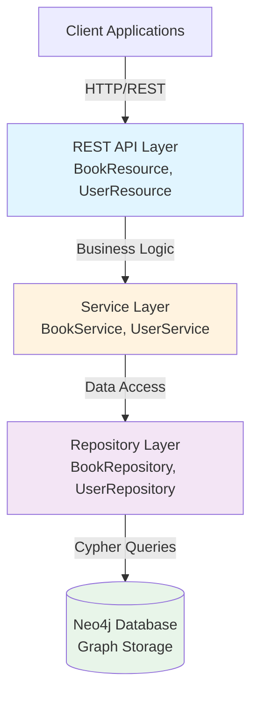
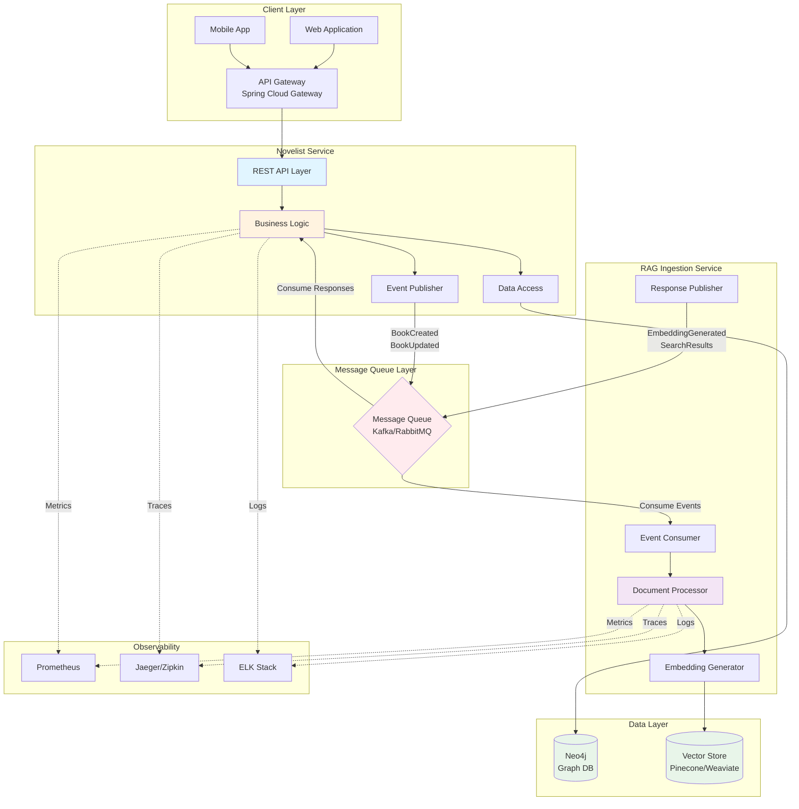
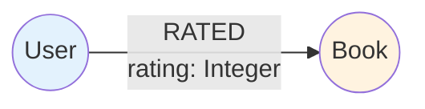
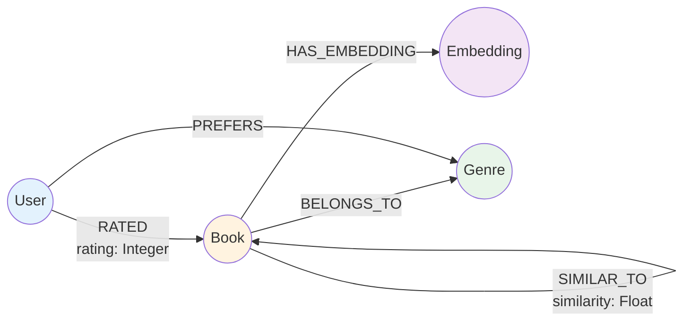
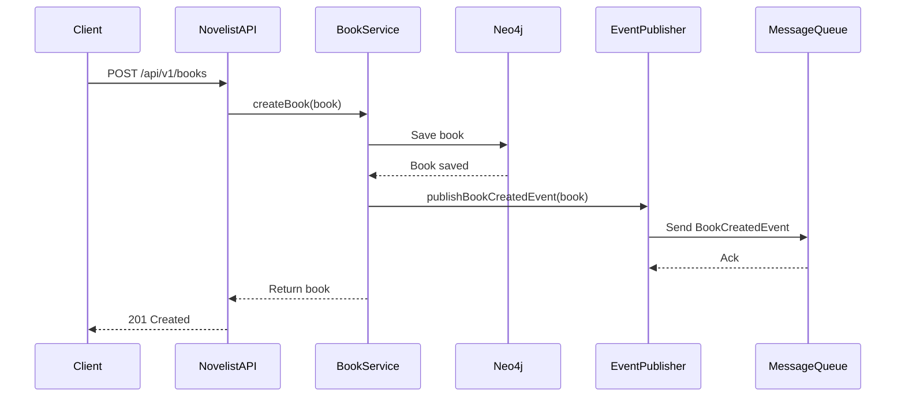
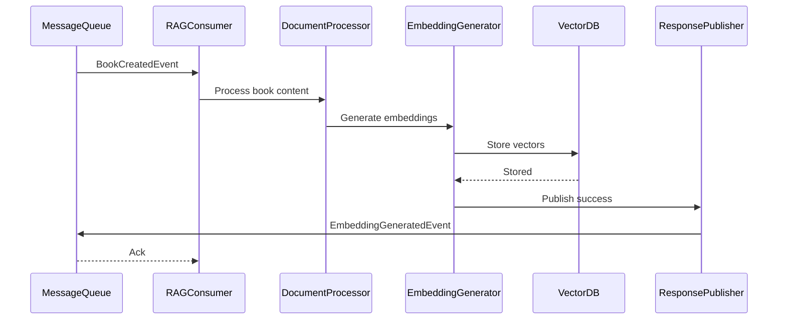
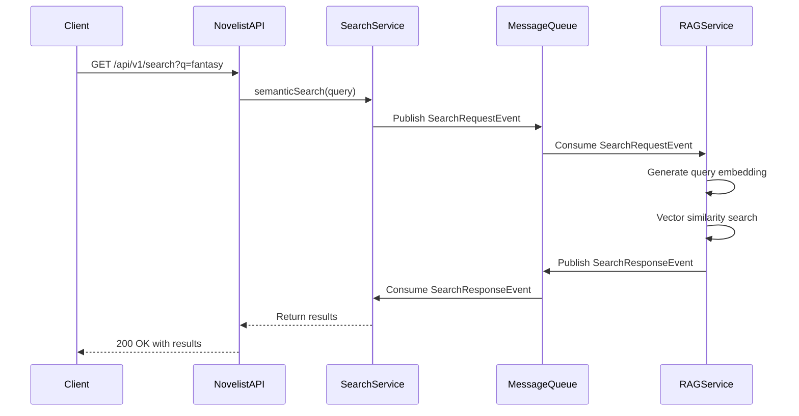
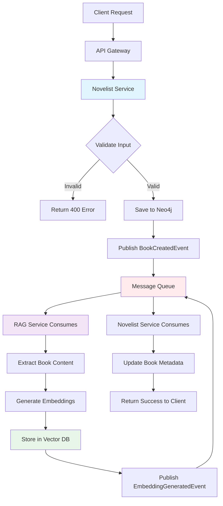
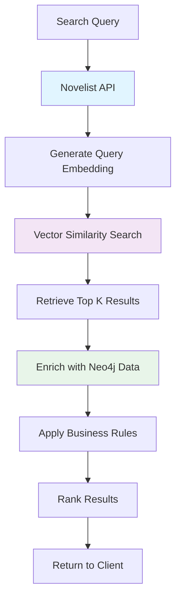

# Novelist Application Architecture

## Table of Contents
- [Overview](#overview)
- [Current Architecture](#current-architecture)
- [Target Architecture with RAG Integration](#target-architecture-with-rag-integration)
- [Technology Stack](#technology-stack)
- [Layer Responsibilities](#layer-responsibilities)
- [Neo4j Graph Model](#neo4j-graph-model)
- [Message Queue Integration Patterns](#message-queue-integration-patterns)
- [Data Flow Diagrams](#data-flow-diagrams)
- [Service Boundaries](#service-boundaries)
- [Architectural Decisions](#architectural-decisions)

## Overview

Novelist is a book rating application built with Spring Boot 3 and Neo4j graph database. The application is evolving from a monolithic architecture to a microservices-based system with RAG (Retrieval-Augmented Generation) integration for enhanced semantic search and intelligent recommendations.

### Key Capabilities
- Book and user management with CRUD operations
- Rating system with relationship properties
- RESTful API with versioning (`/api/v1/`)
- Input validation and global error handling
- Docker containerization support
- **[Planned]** Semantic search powered by RAG
- **[Planned]** Intelligent book recommendations
- **[Planned]** Event-driven architecture with message queues

## Current Architecture

### Monolithic Design



### Current Components

#### 1. Resource Layer (Controllers)
- **Location**: `src/main/java/com/prince/novelist/resource/`
- **Files**: 
  - [`BookResource.java`](../src/main/java/com/prince/novelist/resource/BookResource.java)
  - [`UserResource.java`](../src/main/java/com/prince/novelist/resource/UserResource.java)
- **Responsibilities**:
  - HTTP request/response handling
  - Input validation with `@Valid`
  - HTTP status code management
  - API endpoint mapping

#### 2. Service Layer
- **Location**: `src/main/java/com/prince/novelist/service/`
- **Files**:
  - [`BookService.java`](../src/main/java/com/prince/novelist/service/BookService.java)
  - [`UserService.java`](../src/main/java/com/prince/novelist/service/UserService.java)
- **Responsibilities**:
  - Business logic implementation
  - Transaction management
  - Exception handling
  - Data validation

#### 3. Repository Layer
- **Location**: `src/main/java/com/prince/novelist/repository/`
- **Files**:
  - [`BookRepository.java`](../src/main/java/com/prince/novelist/repository/BookRepository.java)
  - [`UserRepository.java`](../src/main/java/com/prince/novelist/repository/UserRepository.java)
- **Responsibilities**:
  - Neo4j data access
  - Custom Cypher queries
  - CRUD operations

#### 4. Model Layer
- **Location**: `src/main/java/com/prince/novelist/model/`
- **Files**:
  - [`Book.java`](../src/main/java/com/prince/novelist/model/Book.java)
  - [`User.java`](../src/main/java/com/prince/novelist/model/User.java)
  - [`RatingRelation.java`](../src/main/java/com/prince/novelist/model/RatingRelation.java)
  - [`Review.java`](../src/main/java/com/prince/novelist/model/Review.java)
- **Responsibilities**:
  - Domain model definition
  - Neo4j node/relationship mapping
  - Validation constraints

#### 5. Exception Handling
- **Location**: `src/main/java/com/prince/novelist/exception/`
- **Files**:
  - [`GlobalExceptionHandler.java`](../src/main/java/com/prince/novelist/exception/GlobalExceptionHandler.java)
  - [`ResourceNotFoundException.java`](../src/main/java/com/prince/novelist/exception/ResourceNotFoundException.java)
  - [`InvalidRequestException.java`](../src/main/java/com/prince/novelist/exception/InvalidRequestException.java)
- **Responsibilities**:
  - Centralized exception handling
  - Consistent error responses
  - HTTP status mapping

### Current Limitations

1. **Monolithic Architecture**: All functionality in a single deployable unit
2. **No Semantic Search**: Basic CRUD operations only, no intelligent search
3. **Limited Scalability**: Cannot scale individual components independently
4. **No Event-Driven Capabilities**: Synchronous processing only
5. **No Advanced Recommendations**: Simple rating-based queries only

## Target Architecture with RAG Integration

### Microservices Design
 


### Service Decomposition

#### 1. Novelist Service (Core)
**Responsibilities**:
- Book and user management
- Rating system
- RESTful API endpoints
- Event publishing for book operations
- Event consumption for RAG responses
- Business logic orchestration

**Technology**:
- Spring Boot 3.4.1
- Spring Data Neo4j 7
- Spring Kafka/RabbitMQ
- Jakarta Validation

#### 2. RAG Ingestion Service
**Responsibilities**:
- Document ingestion and processing
- Text chunking and preprocessing
-Embedding generation (OpenAI, Sentence Transformers, etc.)
- Vector storage management
- Semantic search query processing
- Similarity computation

**Technology Options**:
- **Option A**: Python-based (LangChain, FastAPI)
- **Option B**: Java-based (Spring Boot, DJL)
- **Option C**: External service (OpenAI, Pinecone)

#### 3. API Gateway (Optional)
**Responsibilities**:
- Request routing
- Load balancing
- Authentication/Authorization
- Rate limiting
- API composition

**Technology**:
- Spring Cloud Gateway
- Kong
- Nginx

## Technology Stack

### Current Stack
| Component | Technology | Version |
|-----------|-----------|---------|
| Framework | Spring Boot | 3.4.1 |
| Language | Java | 17 |
| Database | Neo4j | 5.15.0 |
| Build Tool | Maven | 3.6+ |
| API Docs | SpringDoc OpenAPI | 2.8.9 |
| Testing | JUnit 5, Mockito, Testcontainers | Latest |
| Containerization | Docker, Docker Compose | Latest |

### Planned Additions for RAG Integration

#### Message Queue Options

**Option 1: Apache Kafka**
- **Pros**: High throughput, event streaming, scalability, durability
- **Cons**: Complex setup, resource-intensive
- **Use Case**: High-volume event processing, event sourcing
- **Dependencies**:
  ```xml
  <dependency>
      <groupId>org.springframework.kafka</groupId>
      <artifactId>spring-kafka</artifactId>
  </dependency>
  ```

**Option 2: RabbitMQ**
- **Pros**: Simpler setup, flexible routing, good for traditional messaging
- **Cons**: Lower throughput than Kafka
- **Use Case**: Traditional request-response patterns, task queues
- **Dependencies**:
  ```xml
  <dependency>
      <groupId>org.springframework.boot</groupId>
      <artifactId>spring-boot-starter-amqp</artifactId>
  </dependency>
  ```

#### Vector Storage Options

**Option 1: Neo4j Vector Indexes (5.11+)**
- **Pros**: Single database, graph + vector queries, no additional infrastructure
- **Cons**: Newer feature, limited ecosystem
- **Configuration**:
  ```cypher
  CREATE VECTOR INDEX book_embeddings FOR (b:Book) ON (b.embedding)
  OPTIONS {indexConfig: {
    `vector.dimensions`: 1536,
    `vector.similarity_function`: 'cosine'
  }}
  ```

**Option 2: Dedicated Vector Database**
- **Pinecone**: Managed, scalable, easy to use
- **Weaviate**: Open-source, GraphQL API, hybrid search
- **Qdrant**: Open-source, Rust-based, high performance
- **Milvus**: Open-source, highly scalable, cloud-native

**Option 3: Hybrid Approach**
- Metadata in Neo4j (books, users, ratings)
- Vectors in dedicated vector DB
- Best of both worlds

#### Authentication Options

**Option 1: JWT with Spring Security**
```xml
<dependency>
    <groupId>org.springframework.boot</groupId>
    <artifactId>spring-boot-starter-security</artifactId>
</dependency>
<dependency>
    <groupId>io.jsonwebtoken</groupId>
    <artifactId>jjwt-api</artifactId>
    <version>0.12.3</version>
</dependency>
```

**Option 2: OAuth2/OIDC**
```xml
<dependency>
    <groupId>org.springframework.boot</groupId>
    <artifactId>spring-boot-starter-oauth2-resource-server</artifactId>
</dependency>
```

**Option 3: API Keys for Service-to-Service**
- Custom header-based authentication
- Stored in environment variables
- Rotated regularly

## Layer Responsibilities

### 1. Resource Layer (REST Controllers)
```
Responsibilities:
├── HTTP request/response handling
├── Input validation (@Valid)
├── HTTP status code management
├── API documentation (Swagger)
├── Request/Response DTOs
└── Exception handling delegation

Anti-patterns to avoid:
├── Business logic in controllers
├── Direct database access
└── Complex data transformations
```

### 2. Service Layer
```
Responsibilities:
├── Business logic implementation
├── Transaction management (@Transactional)
├── Event publishing (Kafka/RabbitMQ)
├── Event consumption and processing
├── Data validation
├── Exception handling
└── Orchestration of multiple repositories

Anti-patterns to avoid:
├── Direct HTTP handling
├── Cypher query construction
└── DTO to entity mapping (use MapStruct)
```

### 3. Repository Layer
```
Responsibilities:
├── Neo4j data access
├── Custom Cypher queries
├── CRUD operations
├── Query optimization
└── Database-specific logic

Anti-patterns to avoid:
├── Business logic
├── Transaction management
└── Exception translation (let Spring handle it)
```

### 4. Event Layer (New)
```
Responsibilities:
├── Event publishing to message queue
├── Event consumption from message queue
├── Event schema validation
├── Idempotency handling
├── Dead letter queue management
└── Event ordering guarantees

Components:
├── Event Publishers
├── Event Consumers
├── Event DTOs
└── Event Handlers
```

## Neo4j Graph Model

### Current Model



### Node Properties

#### User Node
```cypher
(:User {
  userId: String (UUID),
  name: String,
  age: Long
})
```

**Constraints**:
```cypher
CREATE CONSTRAINT user_id_unique IF NOT EXISTS
FOR (u:User) REQUIRE u.userId IS UNIQUE;

CREATE INDEX user_name_index IF NOT EXISTS
FOR (u:User) ON (u.name);
```

#### Book Node
```cypher
(:Book {
  bookId: String (UUID),
  title: String,
  author: String
})
```

**Constraints**:
```cypher
CREATE CONSTRAINT book_id_unique IF NOT EXISTS
FOR (b:Book) REQUIRE b.bookId IS UNIQUE;

CREATE INDEX book_title_index IF NOT EXISTS
FOR (b:Book) ON (b.title);

CREATE INDEX book_author_index IF NOT EXISTS
FOR (b:Book) ON (b.author);
```

### Relationship Properties

#### RATED Relationship
```cypher
(:User)-[:RATED {
  rating: Integer (1-5),
  timestamp: DateTime (optional)
}]->(:Book)
```

### Enhanced Model with RAG Integration



#### New Nodes for RAG

**Embedding Node** (Option 1: Store in Neo4j)
```cypher
(:Embedding {
  embeddingId: String (UUID),
  vector: List<Float>,  // 1536 dimensions for OpenAI
  model: String,        // "text-embedding-ada-002"
  createdAt: DateTime
})
```

**Genre Node**
```cypher
(:Genre {
  genreId: String (UUID),
  name: String,
  description: String
})
```

#### New Relationships

**HAS_EMBEDDING**
```cypher
(:Book)-[:HAS_EMBEDDING {
  version: Integer,
  createdAt: DateTime
}]->(:Embedding)
```

**SIMILAR_TO**
```cypher
(:Book)-[:SIMILAR_TO {
  similarity: Float (0.0-1.0),
  method: String,  // "cosine", "euclidean"
  computedAt: DateTime
}]->(:Book)
```

**BELONGS_TO**
```cypher
(:Book)-[:BELONGS_TO]->(:Genre)
```

**PREFERS**
```cypher
(:User)-[:PREFERS {
  strength: Float (0.0-1.0)
}]->(:Genre)
```

### Vector Index Configuration (Neo4j 5.11+)

```cypher
-- Create vector index for book embeddings
CREATE VECTOR INDEX book_embeddings IF NOT EXISTS
FOR (b:Book) ON (b.embedding)
OPTIONS {
  indexConfig: {
    `vector.dimensions`: 1536,
    `vector.similarity_function`: 'cosine'
  }
};

-- Query similar books using vector similarity
MATCH (b:Book)
WHERE b.embedding IS NOT NULL
CALL db.index.vector.queryNodes('book_embeddings', 10, $queryVector)
YIELD node, score
RETURN node.title, node.author, score
ORDER BY score DESC;
```

## Message Queue Integration Patterns

### Event-Driven Architecture Patterns

#### 1. Event Publishing Pattern



#### 2. Event Consumption Pattern



#### 3. Request-Response Pattern (Async)



### Event Types

1. **BookCreatedEvent**: Published when a new book is created
2. **BookUpdatedEvent**: Published when book details are updated
3. **BookDeletedEvent**: Published when a book is deleted
4. **UserCreatedEvent**: Published when a new user registers
5. **RatingAddedEvent**: Published when a user rates a book
6. **EmbeddingGeneratedEvent**: Published when embeddings are created
7. **SearchRequestEvent**: Published for semantic search queries
8. **SearchResponseEvent**: Published with search results
9. **RecommendationRequestEvent**: Published for recommendation queries
10. **RecommendationResponseEvent**: Published with recommendations

## Data Flow Diagrams

### Book Creation Flow with RAG Integration



### Semantic Search Flow



## Service Boundaries

### Novelist Service Boundaries

**Owns**:
- Book CRUD operations
- User management
- Rating system
- Business logic
- Neo4j graph data
- API endpoints

**Depends On**:
- RAG service for embeddings
- Message queue for async communication
- Vector database (indirectly through RAG service)

**Exposes**:
- REST API (`/api/v1/*`)
- Event publishers
- Event consumers

### RAG Service Boundaries

**Owns**:
- Document processing
- Embedding generation
- Vector storage
- Semantic search
- Similarity computation

**Depends On**:
- Message queue for events
- Embedding model (OpenAI, HuggingFace, etc.)
- Vector database

**Exposes**:
- Event consumers
- Event publishers
- (Optional) Internal REST API

## Architectural Decisions

### ADR-001: Microservices vs Monolith

**Status**: Proposed

**Context**: Current monolithic architecture limits scalability and independent deployment of RAG features.

**Decision**: Evolve to microservices architecture with Novelist service and RAG service as separate deployable units.

**Consequences**:
- ✅ Independent scaling of services
- ✅ Technology flexibility for RAG service
- ✅ Fault isolation
- ❌ Increased operational complexity
- ❌ Distributed system challenges

### ADR-002: Message Queue Technology

**Status**: Proposed

**Options**:
1. **Kafka**: Event streaming, high throughput, event sourcing
2. **RabbitMQ**: Traditional messaging, simpler setup, flexible routing

**Recommendation**: Start with RabbitMQ for simplicity, migrate to Kafka if event streaming is needed.

**Consequences**:
- ✅ Async communication between services
- ✅ Decoupling of services
- ✅ Retry and error handling
- ❌ Additional infrastructure
- ❌ Eventual consistency

### ADR-003: Vector Storage Strategy

**Status**: Proposed

**Options**:
1. **Neo4j Vector Indexes**: Single database, graph + vector queries
2. **Dedicated Vector DB**: Specialized, better performance
3. **Hybrid**: Metadata in Neo4j, vectors in dedicated DB

**Recommendation**: Hybrid approach for production, Neo4j vectors for development.

**Consequences**:
- ✅ Best performance for vector operations
- ✅ Flexibility to change vector DB
- ❌ Data synchronization complexity
- ❌ Additional infrastructure

### ADR-004: Authentication Strategy

**Status**: Proposed

**Options**:
1. **JWT with Spring Security**: Stateless, simple
2. **OAuth2/OIDC**: Standard, integrates with identity providers
3. **API Keys**: Simple for service-to-service

**Recommendation**: JWT for user authentication, API keys for service-to-service.

**Consequences**:
- ✅ Stateless authentication
- ✅ Secure service communication
- ✅ Standard approach
- ❌ Token management complexity
- ❌ Key rotation required

### ADR-005: Event Schema Evolution

**Status**: Proposed

**Decision**: Use schema versioning for events with backward compatibility.

**Strategy**:
- Include version field in all events
- Support multiple versions simultaneously
- Deprecate old versions gradually

**Consequences**:
- ✅ Backward compatibility
- ✅ Gradual migration
- ❌ Version management overhead

## Next Steps

1. Review and approve architectural decisions
2. Set up development environment with message queue
3. Implement event publishing in Novelist service
4. Develop RAG service (or integrate with external service)
5. Implement event consumption and processing
6. Add semantic search endpoints
7. Implement recommendation engine
8. Set up monitoring and observability
9. Performance testing and optimization
10. Production deployment

## References

- [Spring Boot Documentation](https://docs.spring.io/spring-boot/docs/current/reference/html/)
- [Spring Data Neo4j](https://docs.spring.io/spring-data/neo4j/docs/current/reference/html/)
- [Neo4j Vector Indexes](https://neo4j.com/docs/cypher-manual/current/indexes-for-vector-search/)
- [Apache Kafka](https://kafka.apache.org/documentation/)
- [RabbitMQ](https://www.rabbitmq.com/documentation.html)
- [Microservices Patterns](https://microservices.io/patterns/index.html)
- [Event-Driven Architecture](https://martinfowler.com/articles/201701-event-driven.html)

---

**Document Version**: 1.0  
**Last Updated**: 2026-06-18  
**Author**: Bob (AI Assistant)  
**Status**: Draft