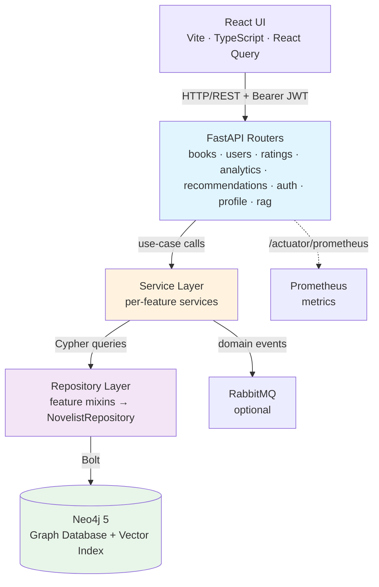
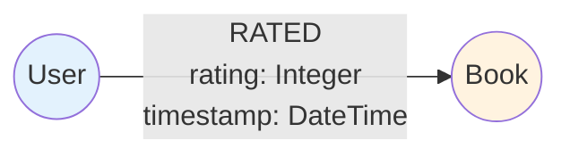
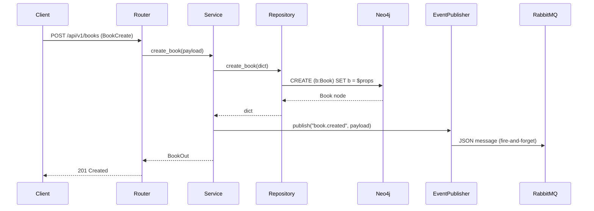

# Novelist Application Architecture

## Table of Contents
- [Overview](#overview)
- [Current Architecture](#current-architecture)
- [Technology Stack](#technology-stack)
- [Layer Responsibilities](#layer-responsibilities)
- [Neo4j Graph Model](#neo4j-graph-model)
- [Event Publishing](#event-publishing)
- [Data Flow](#data-flow)
- [Architectural Decisions](#architectural-decisions)

## Overview

Novelist is a full-stack book-management application. The **backend** is a Python 3.13 / FastAPI modular monolith; the **frontend** is a React 18 / Vite / TypeScript single-page application. The backend uses Neo4j for persistence, RabbitMQ for optional domain-event publishing, and a local sentence-transformers model for RAG semantic search.

### Key Capabilities
- Book and user management (full CRUD)
- Rating and review system with relationship properties
- Reading analytics (trending books, genre stats, per-book stats)
- Graph-based collaborative-filtering recommendations
- JWT authentication with bcrypt password hashing and server-side refresh-token revocation
- Prometheus metrics and health check endpoints
- Optional domain-event publishing over RabbitMQ (persistent connection, auto-reconnect)
- RAG semantic search: local embeddings, Neo4j vector index, chat-style UI
- React UI: book browsing, add/rate/review, profile, trending analytics, AI search chat

## Current Architecture

### Modular Monolith



### Directory Layout

```
app/
├── main.py                      # Bootstrap: lifespan, router registration, exception handlers
├── core/
│   ├── config.py                # pydantic-settings — reads .env / env vars; cors_origins parsed as str
│   ├── dependencies.py          # FastAPI Depends factories (Repo, Publisher, Services)
│   ├── http.py                  # error() helper for consistent JSONResponse errors
│   ├── pagination.py            # PageOut make_page helper
│   └── security.py              # JWT encode/decode, bcrypt hashing, HTTPBearer, require_self()
├── infrastructure/
│   ├── neo4j/
│   │   ├── base.py              # Neo4jRepository, NotFoundError, ConflictError, Cypher helpers
│   │   └── repository.py        # NovelistRepository — composed from all feature mixins
│   └── messaging/
│       └── publisher.py         # EventPublisher (persistent pika connection, auto-reconnect)
└── modules/
    ├── auth/                    # register, login → JWT (access + refresh with revocation)
    ├── books/                   # CRUD + paginated search with 7 filter/sort params
    ├── users/                   # CRUD + preferences; mutations require caller == userId
    ├── ratings/                 # add rating+review; requires caller == userId
    ├── analytics/               # book stats (BookStatsOut), trending, genre breakdown (GenreCountOut)
    ├── recommendations/         # graph-based collaborative filtering
    ├── profile/                 # GET /api/v1/me
    ├── rag/                     # chunk+embed index, Neo4j vector search
    └── shared/                  # APIModel base, PageOut, Preferences schemas

ui/src/
├── api/                         # Typed axios client: auth, books, ratings, analytics, profile, rag
├── context/AuthContext.tsx      # JWT login/logout/register; decodes userId from token
├── components/
│   ├── AppShell.tsx             # Sidebar nav (Books, Trending, Profile, AI Search) + sign-out
│   ├── AddBookModal.tsx         # Book creation form
│   ├── RateReviewModal.tsx      # Star picker (1–5) + review textarea
│   └── ProtectedRoute.tsx       # Redirects unauthenticated users to /login
└── pages/
    ├── AuthPages.tsx            # Login + Register forms
    ├── BooksPage.tsx            # Paginated grid, search, filter, sort; Add Book
    ├── BookDetailPage.tsx       # Metadata, live stats, Rate & Review, Delete
    ├── ProfilePage.tsx          # Identity card + full reading history
    ├── TrendingPage.tsx         # Top-10 ranking + genre bar chart
    └── ChatPage.tsx             # Chat-style RAG semantic search
```

Each module follows the same internal layout:

```
<module>/
├── ports.py       # Protocol interfaces (dependency-inversion boundary)
├── schemas.py     # Pydantic request/response models
├── service.py     # Use-case logic; depends on ports
├── repository.py  # Neo4j mixin; implements the port
└── router.py      # FastAPI router; calls service via DI
```

## Technology Stack

| Component | Technology | Version |
|-----------|-----------|---------|
| Language | Python | 3.13 |
| Framework | FastAPI | ≥0.115 |
| Data validation | Pydantic v2 / pydantic-settings | ≥2.3 |
| Database | Neo4j | 5 (Bolt) |
| DB driver | neo4j (official Python driver) | ≥5.24 |
| Auth | python-jose (JWT) + passlib/bcrypt | ≥3.3 / ≥1.7 |
| Messaging | pika (RabbitMQ AMQP) | ≥1.3 |
| Metrics | prometheus-fastapi-instrumentator | ≥8.0 |
| ASGI server | uvicorn | ≥0.30 |
| Tests | pytest | ≥7.0 |
| Containerization | Docker + Docker Compose | — |

## Layer Responsibilities

### Router Layer (`router.py`)
- HTTP request/response handling
- Input validation via Pydantic models (automatic with FastAPI)
- HTTP status codes
- Delegates all logic to the service layer

### Service Layer (`service.py`)
- Business-logic implementation
- Calls repository port methods
- Publishes domain events via `EventPublisher`
- Raises `NotFoundError` / `ConflictError` — handled centrally in `main.py`

### Repository Layer (`repository.py` mixins)
- All Cypher query construction
- Maps raw Neo4j records to plain `dict` via `node()` helper
- Composed into `NovelistRepository` at startup

### Infrastructure Layer
- `Neo4jRepository` — connection lifecycle, `_one` / `_all` query helpers
- `EventPublisher` — fire-and-forget RabbitMQ publish; AMQP errors are logged, never surfaced to callers

## Neo4j Graph Model

### Current Model



### Node Properties

**User**
```cypher
(:User {
  userId:    String,   // UUID
  name:      String,
  email:     String,   // unique
  password:  String,   // bcrypt hash
  age:       Integer,
  preferences: Map,    // favoriteGenres, favoriteAuthors, annualReadingGoal, …
  createdAt: DateTime,
  updatedAt: DateTime
})
```

**Book**
```cypher
(:Book {
  bookId:       String,   // UUID
  title:        String,
  author:       String,
  isbn:         String,   // optional, unique when present
  publishedYear: Integer,
  description:  String,
  language:     String,   // ISO 639-1
  pageCount:    Integer,
  genres:       List<String>,
  createdAt:    DateTime,
  updatedAt:    DateTime
})
```

**RATED relationship**
```cypher
(:User)-[:RATED { rating: Integer (1–5), timestamp: DateTime }]->(:Book)
```

### Constraints & Indexes
```cypher
CREATE CONSTRAINT user_id_unique   IF NOT EXISTS FOR (u:User) REQUIRE u.userId IS UNIQUE;
CREATE CONSTRAINT user_email_unique IF NOT EXISTS FOR (u:User) REQUIRE u.email  IS UNIQUE;
CREATE CONSTRAINT book_id_unique   IF NOT EXISTS FOR (b:Book) REQUIRE b.bookId IS UNIQUE;
CREATE INDEX book_title_index      IF NOT EXISTS FOR (b:Book) ON (b.title);
CREATE INDEX book_author_index     IF NOT EXISTS FOR (b:Book) ON (b.author);
```

## Event Publishing

The `EventPublisher` maintains a **persistent `pika` connection** to a durable topic exchange `novelist.domain.exchange`. On AMQP failure it logs a warning, reconnects once, and retries — if the second attempt also fails the error is swallowed so a broker outage never fails an API write. The connection is cleanly closed during the FastAPI lifespan shutdown. RabbitMQ publishing is **optional** — set `RABBITMQ_ENABLED=false` to disable entirely.

| Routing key | Trigger |
|-------------|---------|
| `book.created` | POST /api/v1/books |
| `book.updated` | PUT /api/v1/books/{id} |
| `book.deleted` | DELETE /api/v1/books/{id} |
| `user.created` | POST /api/v1/users |
| `rating.added` | POST /api/v1/users/{userId}/ratings/{bookId} |

## Data Flow

### Book Creation



## Architectural Decisions

### ADR-001: Modular monolith over microservices
Microservices introduce distributed-systems overhead that is not justified at the current scale. The modular structure uses `Protocol` ports to keep feature boundaries clean and makes a future service split straightforward.

### ADR-002: RabbitMQ topic exchange (optional)
RabbitMQ is simpler to operate than Kafka for the current event volume. Disabling it via `RABBITMQ_ENABLED=false` lets the API run without any message broker dependency (e.g. in tests).

### ADR-003: Neo4j graph database
Graph traversals are the natural query shape for ratings, recommendations, and social relationships between users and books. Neo4j's vector index support also makes it the preferred backend for future RAG embeddings.

### ADR-004: JWT authentication (python-jose + passlib)
Stateless HS256 tokens. Bcrypt hashing via passlib. The `HTTPBearer` dependency in `core/security.py` is used as a FastAPI `Depends` on any protected route.

## ADR-005: React + Vite SPA for the frontend
The UI is a separate Vite dev server (port 5173) rather than server-rendered HTML. This keeps the backend a pure JSON API, allows the UI to be deployed independently (CDN, static hosting), and enables the React Query cache to avoid redundant fetches. The backend's CORS middleware permits the dev origin; production deployments should set `CORS_ORIGINS` explicitly.

## ADR-006: Authorization — caller must own the resource (`require_self`)
`PUT/DELETE /users/{userId}` and `POST /users/{userId}/ratings/{bookId}` validate that the JWT subject matches the URL `userId`. This is enforced by [`core/security.require_self()`](../app/core/security.py) called at the top of each mutating route handler, returning HTTP 403 on mismatch.

## ADR-007: `CORS_ORIGINS` stored as `str`, parsed by `cors_origins_list`
`pydantic-settings` JSON-decodes any field typed as `list[str]` before validators run, so a bare `*` env var causes a startup crash. `cors_origins` is stored as a plain `str` field; the `@computed_field cors_origins_list` property parses it at access time, accepting `*`, comma-separated origins, or a JSON array.

---

**Last Updated**: 2026-08-16
**Status**: Current
