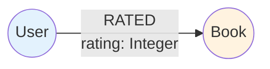
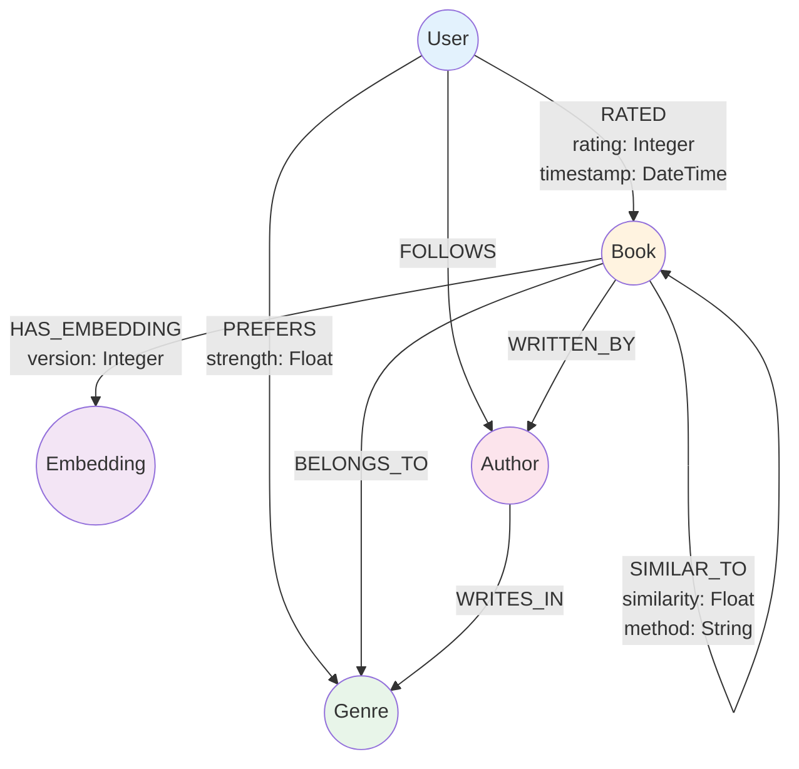

# Database Schema Specification

## Table of Contents
- [Overview](#overview)
- [Neo4j Graph Model](#neo4j-graph-model)
- [Node Types](#node-types)
- [Relationship Types](#relationship-types)
- [Indexes and Constraints](#indexes-and-constraints)
- [Sample Cypher Queries](#sample-cypher-queries)
- [Data Migration Strategy](#data-migration-strategy)
- [Performance Optimization](#performance-optimization)

## Overview

The Novelist application uses Neo4j as its primary database, leveraging the graph model to represent relationships between books, users, ratings, and semantic embeddings. This document defines the complete database schema including nodes, relationships, properties, constraints, and indexes.

### Database Technology

- **Database**: Neo4j 5.15.0
- **Driver**: Spring Data Neo4j 7
- **Query Language**: Cypher
- **Connection**: Bolt protocol (port 7687)

## Neo4j Graph Model

### Current Model



### Enhanced Model with RAG Integration



## Node Types

### User Node

Represents a user in the system.

**Label**: `User`

**Properties**:
```cypher
{
  userId: String (UUID, required, unique),
  name: String (required, 1-100 chars),
  email: String (optional, unique),
  age: Long (required, positive),
  createdAt: DateTime (auto-generated),
  updatedAt: DateTime (auto-updated),
  preferences: Map (optional) {
    genres: List<String>,
    authors: List<String>,
    readingGoal: Integer
  }
}
```

**Java Entity**:
```java
@Node
public class User {
    @Id
    private String userId;
    
    @NotBlank
    @Size(min = 1, max = 100)
    private String name;
    
    @Email
    private String email;
    
    @NotNull
    @Min(0)
    private Long age;
    
    @CreatedDate
    private Instant createdAt;
    
    @LastModifiedDate
    private Instant updatedAt;
    
    private Map<String, Object> preferences;
    
    @Relationship(type = "RATED", direction = Relationship.Direction.OUTGOING)
    private List<RatingRelation> ratedBooks = new ArrayList<>();
    
    @Relationship(type = "PREFERS", direction = Relationship.Direction.OUTGOING)
    private List<GenrePreference> preferredGenres = new ArrayList<>();
}
```

---

### Book Node

Represents a book in the catalog.

**Label**: `Book`

**Properties**:
```cypher
{
  bookId: String (UUID, required, unique),
  title: String (required, 1-200 chars),
  author: String (required, 1-100 chars),
  isbn: String (optional, unique),
  publishedYear: Integer (optional),
  description: String (optional, max 2000 chars),
  content: String (optional, full text),
  language: String (optional, ISO 639-1),
  pageCount: Integer (optional),
  coverImageUrl: String (optional),
  createdAt: DateTime (auto-generated),
  updatedAt: DateTime (auto-updated),
  metadata: Map (optional) {
    publisher: String,
    edition: String,
    format: String
  }
}
```

**Java Entity**:
```java
@Node
public class Book {
    @Id
    private String bookId;
    
    @NotBlank
    @Size(min = 1, max = 200)
    private String title;
    
    @NotBlank
    @Size(min = 1, max = 100)
    private String author;
    
    private String isbn;
    private Integer publishedYear;
    
    @Size(max = 2000)
    private String description;
    
    private String content;
    private String language;
    private Integer pageCount;
    private String coverImageUrl;
    
    @CreatedDate
    private Instant createdAt;
    
    @LastModifiedDate
    private Instant updatedAt;
    
    private Map<String, Object> metadata;
    
    @Relationship(type = "HAS_EMBEDDING", direction = Relationship.Direction.OUTGOING)
    private EmbeddingRelation embedding;
    
    @Relationship(type = "BELONGS_TO", direction = Relationship.Direction.OUTGOING)
    private List<Genre> genres = new ArrayList<>();
}
```

---

### Embedding Node

Stores vector embeddings for semantic search.

**Label**: `Embedding`

**Properties**:
```cypher
{
  embeddingId: String (UUID, required, unique),
  vector: List<Float> (required, 1536 dimensions for OpenAI),
  model: String (required, e.g., "text-embedding-ada-002"),
  dimensions: Integer (required),
  createdAt: DateTime (auto-generated),
  metadata: Map (optional) {
    chunkIndex: Integer,
    totalChunks: Integer,
    textLength: Integer
  }
}
```

**Note**: For Neo4j 5.11+, vectors can be stored directly on Book nodes using vector indexes.

**Alternative: Vector Property on Book Node**:
```cypher
{
  bookId: String,
  title: String,
  author: String,
  embedding: List<Float> (1536 dimensions),
  embeddingModel: String,
  embeddingCreatedAt: DateTime
}
```

---

### Genre Node

Represents book genres/categories.

**Label**: `Genre`

**Properties**:
```cypher
{
  genreId: String (UUID, required, unique),
  name: String (required, unique),
  description: String (optional),
  parentGenre: String (optional, for hierarchical genres),
  createdAt: DateTime (auto-generated)
}
```

**Java Entity**:
```java
@Node
public class Genre {
    @Id
    private String genreId;
    
    @NotBlank
    private String name;
    
    private String description;
    private String parentGenre;
    
    @CreatedDate
    private Instant createdAt;
}
```

---

### Author Node (Optional Enhancement)

Represents book authors as separate entities.

**Label**: `Author`

**Properties**:
```cypher
{
  authorId: String (UUID, required, unique),
  name: String (required, unique),
  biography: String (optional),
  birthYear: Integer (optional),
  nationality: String (optional),
  website: String (optional),
  createdAt: DateTime (auto-generated)
}
```

---

## Relationship Types

### RATED Relationship

Connects users to books they've rated.

**Type**: `RATED`

**Direction**: `(User)-[:RATED]->(Book)`

**Properties**:
```cypher
{
  rating: Integer (required, 1-5),
  review: String (optional, max 1000 chars),
  timestamp: DateTime (required, auto-generated),
  helpful: Integer (optional, count of helpful votes)
}
```

**Java Relationship**:
```java
@RelationshipProperties
public class RatingRelation {
    @RelationshipId
    private Long id;
    
    @NotNull
    @Min(1)
    @Max(5)
    private Integer rating;
    
    @Size(max = 1000)
    private String review;
    
    @CreatedDate
    private Instant timestamp;
    
    private Integer helpful;
    
    @TargetNode
    private Book book;
}
```

---

### HAS_EMBEDDING Relationship

Connects books to their embeddings.

**Type**: `HAS_EMBEDDING`

**Direction**: `(Book)-[:HAS_EMBEDDING]->(Embedding)`

**Properties**:
```cypher
{
  version: Integer (required, for versioning),
  createdAt: DateTime (required),
  active: Boolean (required, default: true)
}
```

---

### SIMILAR_TO Relationship

Connects similar books based on embeddings.

**Type**: `SIMILAR_TO`

**Direction**: `(Book)-[:SIMILAR_TO]->(Book)`

**Properties**:
```cypher
{
  similarity: Float (required, 0.0-1.0),
  method: String (required, e.g., "cosine", "euclidean"),
  computedAt: DateTime (required),
  rank: Integer (optional, similarity rank)
}
```

---

### BELONGS_TO Relationship

Connects books to genres.

**Type**: `BELONGS_TO`

**Direction**: `(Book)-[:BELONGS_TO]->(Genre)`

**Properties**:
```cypher
{
  primary: Boolean (optional, indicates primary genre),
  addedAt: DateTime (auto-generated)
}
```

---

### PREFERS Relationship

Connects users to their preferred genres.

**Type**: `PREFERS`

**Direction**: `(User)-[:PREFERS]->(Genre)`

**Properties**:
```cypher
{
  strength: Float (required, 0.0-1.0, preference strength),
  updatedAt: DateTime (auto-updated)
}
```

---

### WRITTEN_BY Relationship (Optional)

Connects books to authors.

**Type**: `WRITTEN_BY`

**Direction**: `(Book)-[:WRITTEN_BY]->(Author)`

**Properties**:
```cypher
{
  role: String (optional, e.g., "author", "co-author"),
  order: Integer (optional, for multiple authors)
}
```

---

### FOLLOWS Relationship (Optional)

Connects users to authors they follow.

**Type**: `FOLLOWS`

**Direction**: `(User)-[:FOLLOWS]->(Author)`

**Properties**:
```cypher
{
  followedAt: DateTime (auto-generated),
  notifications: Boolean (default: true)
}
```

---

## Indexes and Constraints

### Unique Constraints

```cypher
-- User constraints
CREATE CONSTRAINT user_id_unique IF NOT EXISTS
FOR (u:User) REQUIRE u.userId IS UNIQUE;

CREATE CONSTRAINT user_email_unique IF NOT EXISTS
FOR (u:User) REQUIRE u.email IS UNIQUE;

-- Book constraints
CREATE CONSTRAINT book_id_unique IF NOT EXISTS
FOR (b:Book) REQUIRE b.bookId IS UNIQUE;

CREATE CONSTRAINT book_isbn_unique IF NOT EXISTS
FOR (b:Book) REQUIRE b.isbn IS UNIQUE;

-- Embedding constraints
CREATE CONSTRAINT embedding_id_unique IF NOT EXISTS
FOR (e:Embedding) REQUIRE e.embeddingId IS UNIQUE;

-- Genre constraints
CREATE CONSTRAINT genre_id_unique IF NOT EXISTS
FOR (g:Genre) REQUIRE g.genreId IS UNIQUE;

CREATE CONSTRAINT genre_name_unique IF NOT EXISTS
FOR (g:Genre) REQUIRE g.name IS UNIQUE;

-- Author constraints (optional)
CREATE CONSTRAINT author_id_unique IF NOT EXISTS
FOR (a:Author) REQUIRE a.authorId IS UNIQUE;
```

### Property Indexes

```cypher
-- User indexes
CREATE INDEX user_name_index IF NOT EXISTS
FOR (u:User) ON (u.name);

CREATE INDEX user_created_at_index IF NOT EXISTS
FOR (u:User) ON (u.createdAt);

-- Book indexes
CREATE INDEX book_title_index IF NOT EXISTS
FOR (b:Book) ON (b.title);

CREATE INDEX book_author_index IF NOT EXISTS
FOR (b:Book) ON (b.author);

CREATE INDEX book_published_year_index IF NOT EXISTS
FOR (b:Book) ON (b.publishedYear);

CREATE INDEX book_language_index IF NOT EXISTS
FOR (b:Book) ON (b.language);

CREATE INDEX book_created_at_index IF NOT EXISTS
FOR (b:Book) ON (b.createdAt);

-- Full-text search indexes
CREATE FULLTEXT INDEX book_fulltext_index IF NOT EXISTS
FOR (b:Book) ON EACH [b.title, b.author, b.description];

-- Genre indexes
CREATE INDEX genre_name_index IF NOT EXISTS
FOR (g:Genre) ON (g.name);
```

### Vector Indexes (Neo4j 5.11+)

```cypher
-- Vector index for book embeddings
CREATE VECTOR INDEX book_embeddings IF NOT EXISTS
FOR (b:Book) ON (b.embedding)
OPTIONS {
  indexConfig: {
    `vector.dimensions`: 1536,
    `vector.similarity_function`: 'cosine'
  }
};

-- Alternative: Vector index on Embedding nodes
CREATE VECTOR INDEX embedding_vectors IF NOT EXISTS
FOR (e:Embedding) ON (e.vector)
OPTIONS {
  indexConfig: {
    `vector.dimensions`: 1536,
    `vector.similarity_function`: 'cosine'
  }
};
```

### Composite Indexes

```cypher
-- Composite index for book search
CREATE INDEX book_search_composite IF NOT EXISTS
FOR (b:Book) ON (b.language, b.publishedYear);

-- Composite index for ratings
CREATE INDEX rating_timestamp_composite IF NOT EXISTS
FOR ()-[r:RATED]-() ON (r.rating, r.timestamp);
```

## Sample Cypher Queries

### Basic CRUD Operations

#### Create Book
```cypher
CREATE (b:Book {
  bookId: $bookId,
  title: $title,
  author: $author,
  publishedYear: $publishedYear,
  createdAt: datetime(),
  updatedAt: datetime()
})
RETURN b;
```

#### Get Book by ID
```cypher
MATCH (b:Book {bookId: $bookId})
RETURN b;
```

#### Update Book
```cypher
MATCH (b:Book {bookId: $bookId})
SET b.title = $title,
    b.author = $author,
    b.updatedAt = datetime()
RETURN b;
```

#### Delete Book
```cypher
MATCH (b:Book {bookId: $bookId})
DETACH DELETE b;
```

---

### Rating Operations

#### Add Rating
```cypher
MATCH (u:User {userId: $userId})
MATCH (b:Book {bookId: $bookId})
MERGE (u)-[r:RATED]->(b)
SET r.rating = $rating,
    r.timestamp = datetime()
RETURN u, r, b;
```

#### Get User's Rated Books
```cypher
MATCH (u:User {userId: $userId})-[r:RATED]->(b:Book)
RETURN b, r.rating, r.timestamp
ORDER BY r.timestamp DESC;
```

#### Get Book's Average Rating
```cypher
MATCH (b:Book {bookId: $bookId})<-[r:RATED]-()
RETURN b.title, 
       AVG(r.rating) as avgRating,
       COUNT(r) as numRatings;
```

---

### Search Queries

#### Full-Text Search
```cypher
CALL db.index.fulltext.queryNodes('book_fulltext_index', $searchQuery)
YIELD node, score
RETURN node.bookId, node.title, node.author, score
ORDER BY score DESC
LIMIT 10;
```

#### Filter Books by Genre
```cypher
MATCH (b:Book)-[:BELONGS_TO]->(g:Genre {name: $genreName})
RETURN b
ORDER BY b.title;
```

#### Books by Author
```cypher
MATCH (b:Book {author: $authorName})
RETURN b
ORDER BY b.publishedYear DESC;
```

---

### RAG-Related Queries

#### Store Book Embedding
```cypher
MATCH (b:Book {bookId: $bookId})
CREATE (e:Embedding {
  embeddingId: $embeddingId,
  vector: $vector,
  model: $model,
  dimensions: $dimensions,
  createdAt: datetime()
})
CREATE (b)-[:HAS_EMBEDDING {
  version: 1,
  createdAt: datetime(),
  active: true
}]->(e)
RETURN b, e;
```

#### Vector Similarity Search (Neo4j 5.11+)
```cypher
CALL db.index.vector.queryNodes('book_embeddings', 10, $queryVector)
YIELD node, score
RETURN node.bookId, node.title, node.author, score
ORDER BY score DESC;
```

#### Find Similar Books
```cypher
MATCH (b1:Book {bookId: $bookId})-[s:SIMILAR_TO]->(b2:Book)
WHERE s.similarity > $minSimilarity
RETURN b2, s.similarity
ORDER BY s.similarity DESC
LIMIT 10;
```

#### Create Similarity Relationships
```cypher
MATCH (b1:Book)-[:HAS_EMBEDDING]->(e1:Embedding)
MATCH (b2:Book)-[:HAS_EMBEDDING]->(e2:Embedding)
WHERE b1.bookId < b2.bookId
WITH b1, b2, 
     gds.similarity.cosine(e1.vector, e2.vector) as similarity
WHERE similarity > 0.8
CREATE (b1)-[:SIMILAR_TO {
  similarity: similarity,
  method: 'cosine',
  computedAt: datetime()
}]->(b2)
CREATE (b2)-[:SIMILAR_TO {
  similarity: similarity,
  method: 'cosine',
  computedAt: datetime()
}]->(b1);
```

---

### Recommendation Queries

#### Collaborative Filtering
```cypher
// Find books liked by similar users
MATCH (u:User {userId: $userId})-[r1:RATED]->(b:Book)
WHERE r1.rating >= 4
MATCH (b)<-[r2:RATED]-(other:User)
WHERE r2.rating >= 4 AND other.userId <> $userId
MATCH (other)-[r3:RATED]->(rec:Book)
WHERE r3.rating >= 4 
  AND NOT EXISTS((u)-[:RATED]->(rec))
RETURN rec, COUNT(DISTINCT other) as commonUsers, AVG(r3.rating) as avgRating
ORDER BY commonUsers DESC, avgRating DESC
LIMIT 10;
```

#### Content-Based Recommendations
```cypher
// Recommend books similar to user's highly-rated books
MATCH (u:User {userId: $userId})-[r:RATED]->(b:Book)
WHERE r.rating >= 4
MATCH (b)-[s:SIMILAR_TO]->(rec:Book)
WHERE NOT EXISTS((u)-[:RATED]->(rec))
RETURN rec, AVG(s.similarity) as avgSimilarity, COUNT(b) as matchCount
ORDER BY avgSimilarity DESC, matchCount DESC
LIMIT 10;
```

#### Genre-Based Recommendations
```cypher
// Recommend books from user's preferred genres
MATCH (u:User {userId: $userId})-[p:PREFERS]->(g:Genre)
MATCH (g)<-[:BELONGS_TO]-(b:Book)
WHERE NOT EXISTS((u)-[:RATED]->(b))
OPTIONAL MATCH (b)<-[r:RATED]-()
WITH b, AVG(r.rating) as avgRating, COUNT(r) as numRatings, MAX(p.strength) as genreStrength
WHERE numRatings >= 5
RETURN b, avgRating, numRatings, genreStrength
ORDER BY genreStrength DESC, avgRating DESC, numRatings DESC
LIMIT 10;
```

---

### Analytics Queries

#### Top Rated Books
```cypher
MATCH (b:Book)<-[r:RATED]-()
WITH b, AVG(r.rating) as avgRating, COUNT(r) as numRatings
WHERE numRatings >= 10
RETURN b.bookId, b.title, b.author, avgRating, numRatings
ORDER BY avgRating DESC, numRatings DESC
LIMIT 20;
```

#### Most Active Users
```cypher
MATCH (u:User)-[r:RATED]->()
RETURN u.userId, u.name, COUNT(r) as ratingsCount
ORDER BY ratingsCount DESC
LIMIT 20;
```

#### Genre Popularity
```cypher
MATCH (g:Genre)<-[:BELONGS_TO]-(b:Book)<-[r:RATED]-()
RETURN g.name, 
       COUNT(DISTINCT b) as booksCount,
       COUNT(r) as ratingsCount,
       AVG(r.rating) as avgRating
ORDER BY ratingsCount DESC;
```

#### Trending Books (Last 30 Days)
```cypher
MATCH (b:Book)<-[r:RATED]-()
WHERE r.timestamp > datetime() - duration({days: 30})
WITH b, COUNT(r) as recentRatings, AVG(r.rating) as avgRating
WHERE recentRatings >= 5
RETURN b.bookId, b.title, b.author, recentRatings, avgRating
ORDER BY recentRatings DESC, avgRating DESC
LIMIT 20;
```

---

### Maintenance Queries

#### Clean Up Old Embeddings
```cypher
MATCH (b:Book)-[r:HAS_EMBEDDING]->(e:Embedding)
WHERE r.active = false 
  AND r.createdAt < datetime() - duration({days: 30})
DETACH DELETE e;
```

#### Update Similarity Relationships
```cypher
MATCH ()-[s:SIMILAR_TO]->()
WHERE s.computedAt < datetime() - duration({days: 7})
DELETE s;
```

#### Recompute User Genre Preferences
```cypher
MATCH (u:User)-[r:RATED]->(b:Book)-[:BELONGS_TO]->(g:Genre)
WHERE r.rating >= 4
WITH u, g, COUNT(r) as ratingCount
MERGE (u)-[p:PREFERS]->(g)
SET p.strength = toFloat(ratingCount) / 10.0,
    p.updatedAt = datetime();
```

---

## Data Migration Strategy

### Phase 1: Current Schema
- User nodes with basic properties
- Book nodes with basic properties
- RATED relationships

### Phase 2: Add Genres
```cypher
// Create genre nodes
CREATE (g1:Genre {genreId: randomUUID(), name: 'Fiction', createdAt: datetime()})
CREATE (g2:Genre {genreId: randomUUID(), name: 'Science Fiction', createdAt: datetime()})
CREATE (g3:Genre {genreId: randomUUID(), name: 'Fantasy', createdAt: datetime()})
// ... more genres

// Link existing books to genres (manual or automated)
MATCH (b:Book)
WHERE b.title CONTAINS 'Dragon' OR b.title CONTAINS 'Magic'
MATCH (g:Genre {name: 'Fantasy'})
CREATE (b)-[:BELONGS_TO]->(g);
```

### Phase 3: Add Embeddings
```cypher
// Add embedding property to books
MATCH (b:Book)
SET b.embedding = null,
    b.embeddingModel = null,
    b.embeddingCreatedAt = null;

// Or create separate Embedding nodes
MATCH (b:Book)
CREATE (e:Embedding {
  embeddingId: randomUUID(),
  vector: [],  // Will be populated by RAG service
  model: 'text-embedding-ada-002',
  dimensions: 1536,
  createdAt: datetime()
})
CREATE (b)-[:HAS_EMBEDDING {version: 1, createdAt: datetime(), active: true}]->(e);
```

### Phase 4: Compute Similarities
```cypher
// After embeddings are generated, compute similarities
// This would typically be done by the RAG service
```

---

## Performance Optimization

### Query Optimization Tips

1. **Use Indexes**: Ensure all frequently queried properties have indexes
2. **Limit Results**: Always use `LIMIT` for large result sets
3. **Use Parameters**: Use parameterized queries to enable query plan caching
4. **Profile Queries**: Use `PROFILE` or `EXPLAIN` to analyze query performance
5. **Avoid Cartesian Products**: Be careful with multiple `MATCH` clauses

### Example: Optimized vs Unoptimized Query

**Unoptimized**:
```cypher
MATCH (u:User), (b:Book)
WHERE u.userId = $userId AND b.bookId = $bookId
CREATE (u)-[:RATED {rating: $rating}]->(b);
```

**Optimized**:
```cypher
MATCH (u:User {userId: $userId})
MATCH (b:Book {bookId: $bookId})
CREATE (u)-[:RATED {rating: $rating}]->(b);
```

### Batch Operations

For bulk inserts, use `UNWIND`:

```cypher
UNWIND $books as bookData
CREATE (b:Book {
  bookId: bookData.bookId,
  title: bookData.title,
  author: bookData.author,
  createdAt: datetime()
});
```

### Connection Pooling

Configure connection pool in `application.yml`:

```yaml
spring:
  neo4j:
    pool:
      max-connection-pool-size: 50
      connection-acquisition-timeout: 60s
      max-connection-lifetime: 1h
      idle-time-before-connection-test: 10m
```

---

## Backup and Recovery

### Backup Strategy

```bash
# Full backup
neo4j-admin database dump neo4j --to-path=/backups

# Incremental backup (Enterprise Edition)
neo4j-admin database backup --from=localhost:6362 --to-path=/backups/incremental
```

### Restore

```bash
# Stop Neo4j
neo4j stop

# Restore from backup
neo4j-admin database load neo4j --from-path=/backups/neo4j.dump

# Start Neo4j
neo4j start
```

---

## References

- [Neo4j Cypher Manual](https://neo4j.com/docs/cypher-manual/current/)
- [Spring Data Neo4j Documentation](https://docs.spring.io/spring-data/neo4j/docs/current/reference/html/)
- [Neo4j Vector Indexes](https://neo4j.com/docs/cypher-manual/current/indexes-for-vector-search/)
- [Neo4j Performance Tuning](https://neo4j.com/docs/operations-manual/current/performance/)

---

**Document Version**: 1.0  
**Last Updated**: 2026-06-18  
**Author**: Bob (AI Assistant)  
**Status**: Draft