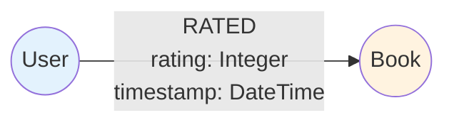
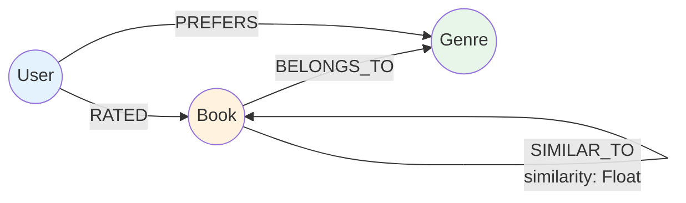

# Database Schema Specification

## Table of Contents
- [Overview](#overview)
- [Neo4j Graph Model](#neo4j-graph-model)
- [Node Types](#node-types)
- [Relationship Types](#relationship-types)
- [Indexes and Constraints](#indexes-and-constraints)
- [Sample Cypher Queries](#sample-cypher-queries)
- [Planned: RAG Enhancements](#planned-rag-enhancements)

## Overview

The Novelist application uses **Neo4j 5** as its primary database. The Python application connects over the Bolt protocol using the [official Neo4j Python driver](https://neo4j.com/docs/python-manual/current/) (`neo4j>=5.24`). All queries are hand-written Cypher executed through the `Neo4jRepository` base class in `app/infrastructure/neo4j/base.py`.

### Database Technology

| Property | Value |
|----------|-------|
| Database | Neo4j 5.15.0 |
| Driver | neo4j Python driver ≥5.24 |
| Query language | Cypher |
| Connection | Bolt (port 7687) |
| Auth | Basic (`NEO4J_USER` / `NEO4J_PASSWORD`) |

## Neo4j Graph Model

### Current Model



## Node Types

### User

```cypher
(:User {
  userId:      String,    // UUID, unique
  name:        String,
  email:       String,    // unique
  password:    String,    // bcrypt hash — never returned in API responses
  age:         Integer,
  preferences: Map {
    favoriteGenres:               List<String>,
    favoriteAuthors:              List<String>,
    annualReadingGoal:            Integer,
    emailNotifications:           Boolean,
    recommendationNotifications:  Boolean
  },
  createdAt:   DateTime,
  updatedAt:   DateTime
})
```

### Book

```cypher
(:Book {
  bookId:        String,   // UUID, unique
  title:         String,
  author:        String,
  isbn:          String,   // optional; unique when present
  publishedYear: Integer,
  description:   String,
  content:       String,   // optional full text (max 1 MB) — for future RAG indexing
  language:      String,   // ISO 639-1 (e.g. "en")
  pageCount:     Integer,
  coverImageUrl: String,
  genres:        List<String>,
  createdAt:     DateTime,
  updatedAt:     DateTime
})
```

## Relationship Types

### RATED

```cypher
(:User)-[:RATED {
  rating:    Integer,   // 1–5
  timestamp: DateTime
}]->(:Book)
```

One `RATED` relationship per `(User, Book)` pair. Adding a second rating merges (updates) the existing one.

## Indexes and Constraints

```cypher
-- Uniqueness constraints (also create an index)
CREATE CONSTRAINT user_id_unique    IF NOT EXISTS FOR (u:User) REQUIRE u.userId IS UNIQUE;
CREATE CONSTRAINT user_email_unique IF NOT EXISTS FOR (u:User) REQUIRE u.email  IS UNIQUE;
CREATE CONSTRAINT book_id_unique    IF NOT EXISTS FOR (b:Book) REQUIRE b.bookId IS UNIQUE;

-- Performance indexes
CREATE INDEX book_title_index       IF NOT EXISTS FOR (b:Book) ON (b.title);
CREATE INDEX book_author_index      IF NOT EXISTS FOR (b:Book) ON (b.author);
CREATE INDEX user_name_index        IF NOT EXISTS FOR (u:User) ON (u.name);
```

## Sample Cypher Queries

### Create a book
```cypher
CREATE (b:Book) SET b = $props RETURN b
```

### Paginated book list with filters
```cypher
MATCH (b:Book)
WHERE ($search IS NULL OR toLower(b.title) CONTAINS toLower($search)
                       OR toLower(b.author) CONTAINS toLower($search))
  AND ($genre IS NULL OR $genre IN b.genres)
  AND ($year  IS NULL OR b.publishedYear = $year)
RETURN b AS entity
ORDER BY b.title
SKIP $skip LIMIT $size
```

### Add / update a rating (merge preserves one edge per pair)
```cypher
MATCH (u:User {userId: $user_id}), (b:Book {bookId: $book_id})
MERGE (u)-[r:RATED]->(b)
SET r.rating = $rating, r.timestamp = $timestamp
RETURN r
```

### Book statistics
```cypher
MATCH (b:Book {bookId: $book_id})
OPTIONAL MATCH (b)<-[r:RATED]-()
RETURN b AS entity,
       count(r)    AS totalRatings,
       avg(r.rating) AS averageRating
```

### Graph-based recommendations (books liked by users with similar taste)
```cypher
MATCH (target:User {userId: $user_id})-[:RATED]->(b:Book)<-[:RATED]-(similar:User)
WHERE similar.userId <> $user_id
MATCH (similar)-[:RATED]->(rec:Book)
WHERE NOT (target)-[:RATED]->(rec)
RETURN rec AS entity, count(*) AS score
ORDER BY score DESC
LIMIT $limit
```

### Trending books (most rated in last N days)
```cypher
MATCH (b:Book)<-[r:RATED]-()
WHERE r.timestamp >= $since
RETURN b AS entity, count(r) AS ratingCount
ORDER BY ratingCount DESC
LIMIT $limit
```

## Planned: RAG Enhancements

When RAG integration is implemented, the schema will extend with:



**Vector index on Book** (Neo4j 5.11+ native vector support):
```cypher
CREATE VECTOR INDEX book_embeddings IF NOT EXISTS
FOR (b:Book) ON (b.embedding)
OPTIONS {
  indexConfig: {
    `vector.dimensions`: 768,
    `vector.similarity_function`: 'cosine'
  }
};
```

---

**Last Updated**: 2026-08-16  
**Status**: Current
