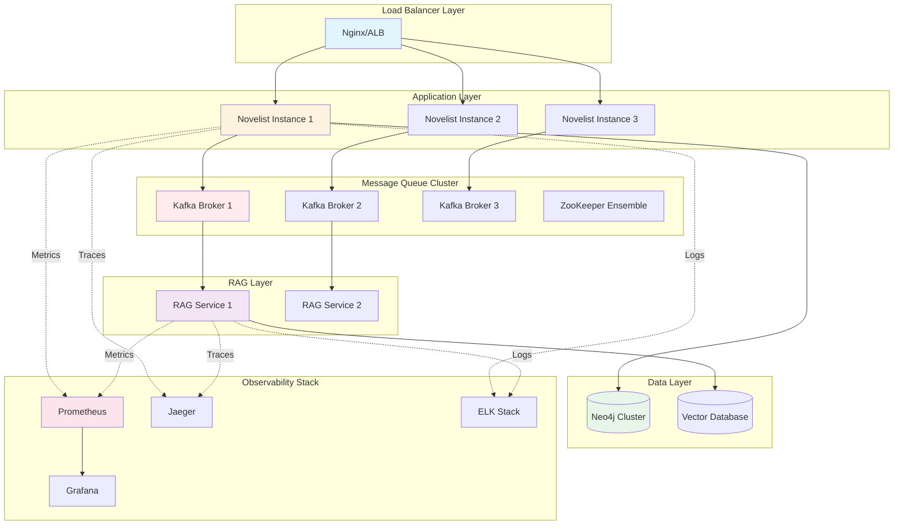

# Deployment Guide

## Table of Contents
- [Overview](#overview)
- [Prerequisites](#prerequisites)
- [Architecture Overview](#architecture-overview)
- [Local Development Setup](#local-development-setup)
- [Docker Compose Deployment](#docker-compose-deployment)
- [Kubernetes Deployment](#kubernetes-deployment)
- [Message Queue Setup](#message-queue-setup)
- [RAG Application Deployment](#rag-application-deployment)
- [Environment Configuration](#environment-configuration)
- [Secrets Management](#secrets-management)
- [CI/CD Pipeline](#cicd-pipeline)
- [Monitoring Setup](#monitoring-setup)
- [Backup and Disaster Recovery](#backup-and-disaster-recovery)
- [Troubleshooting](#troubleshooting)

## Overview

Comprehensive deployment guide for the Novelist application with RAG integration, covering development, staging, and production environments. This guide provides step-by-step instructions for deploying a complete microservices architecture including the Novelist service, RAG application, Neo4j database, message queue, and observability stack.

### Deployment Architecture



## Prerequisites

### Required Software

**Development Environment**:
- Docker 24.0+
- Docker Compose 2.20+
- Java 17+
- Maven 3.6+
- Git
- curl or httpie (for testing)

**Production Environment** (Additional):
- Kubernetes 1.28+
- kubectl CLI
- Helm 3.12+
- AWS CLI / Azure CLI / GCP CLI (for cloud deployments)

### Required Resources

**Development**:
- CPU: 4 cores minimum, 8 cores recommended
- RAM: 8 GB minimum, 16 GB recommended
- Disk: 20 GB free space (SSD recommended)
- Network: Stable internet connection for pulling images

**Staging**:
- CPU: 8 cores minimum
- RAM: 16 GB minimum
- Disk: 50 GB SSD
- Network: Low-latency connection

**Production**:
- CPU: 16+ cores
- RAM: 32+ GB
- Disk: 100+ GB SSD with RAID
- Network: High-bandwidth, low-latency
- Backup storage: 500+ GB

### Cloud Provider Recommendations

**AWS**:
- EKS for Kubernetes
- RDS for managed databases (if not using Neo4j)
- MSK for managed Kafka
- S3 for backups
- CloudWatch for monitoring

**Azure**:
- AKS for Kubernetes
- Azure Database services
- Event Hubs for messaging
- Blob Storage for backups
- Azure Monitor

**GCP**:
- GKE for Kubernetes
- Cloud SQL
- Pub/Sub for messaging
- Cloud Storage for backups
- Cloud Monitoring

## Architecture Overview

### Service Components

1. **Novelist Service** (Port 8081)
   - Spring Boot 3.4.1 application
   - REST API for books, users, ratings, reviews, articles
   - Event publisher for message queue
   - Neo4j client

2. **RAG Application** (Port 8082)
   - Python/FastAPI service
   - Document ingestion and processing
   - Embedding generation
   - Semantic search engine
   - Repository: https://github.com/princenitc/rag_application

3. **Neo4j Database** (Ports 7474, 7687)
   - Graph database for relational data
   - Stores books, users, ratings, reviews, articles
   - Optional: Vector indexes for embeddings

4. **Message Queue** (Kafka: 9092, RabbitMQ: 5672)
   - Event-driven communication
   - Async processing
   - Decoupling services

5. **Vector Database** (Port varies)
   - Stores embeddings
   - Options: Pinecone, Weaviate, Qdrant, Milvus

6. **Observability Stack**
   - Prometheus (9090): Metrics collection
   - Grafana (3000): Dashboards
   - Jaeger (16686): Distributed tracing
   - ELK Stack: Log aggregation

## Local Development Setup

### Step 1: Clone Repositories

```bash
# Create project directory
mkdir novelist-project
cd novelist-project

# Clone Novelist application
git clone https://github.com/your-org/novelist.git
cd novelist

# Clone RAG application
cd ..
git clone https://github.com/princenitc/rag_application.git
```

### Step 2: Environment Setup

```bash
# Navigate to Novelist directory
cd novelist

# Copy environment template
cp .env.example .env

# Edit environment variables
nano .env
```

**Sample .env file**:
```bash
# Application
SPRING_PROFILES_ACTIVE=dev
SERVER_PORT=8081

# Neo4j
NEO4J_URI=bolt://neo4j:7687
NEO4J_USERNAME=neo4j
NEO4J_PASSWORD=devpassword

# Kafka
KAFKA_BOOTSTRAP_SERVERS=kafka:9092

# RAG Service
RAG_SERVICE_URL=http://rag-service:8080
RAG_API_KEY=dev-api-key-12345

# OpenAI (for embeddings)
OPENAI_API_KEY=sk-your-openai-key

# Vector Database (Qdrant example)
VECTOR_DB_URL=http://qdrant:6333
VECTOR_DB_API_KEY=dev-vector-key

# Monitoring
PROMETHEUS_ENABLED=true
JAEGER_ENABLED=true
```

### Step 3: Build Applications

```bash
# Build Novelist application
cd novelist
mvn clean package -DskipTests

# Build RAG application
cd ../rag_application
docker build -t rag-application:dev .
```

### Step 4: Start Services

```bash
# Navigate to Novelist directory
cd novelist

# Start all services
docker-compose -f docker-compose.dev.yml up -d

# Check service health
docker-compose ps

# View logs
docker-compose logs -f
```

### Step 5: Verify Deployment

```bash
# Check Novelist API
curl http://localhost:8081/actuator/health

# Check RAG service
curl http://localhost:8082/health

# Check Neo4j
curl http://localhost:7474

# Check Kafka
docker-compose exec kafka kafka-topics --list --bootstrap-server localhost:9092

# Check Prometheus
curl http://localhost:9090/-/healthy

# Check Grafana
curl http://localhost:3000/api/health
```

### Step 6: Initialize Data

```bash
# Create Kafka topics
docker-compose exec kafka kafka-topics --create \
  --bootstrap-server localhost:9092 \
  --topic book-events \
  --partitions 3 \
  --replication-factor 1

docker-compose exec kafka kafka-topics --create \
  --bootstrap-server localhost:9092 \
  --topic review-events \
  --partitions 3 \
  --replication-factor 1

docker-compose exec kafka kafka-topics --create \
  --bootstrap-server localhost:9092 \
  --topic article-events \
  --partitions 3 \
  --replication-factor 1

# Initialize Neo4j constraints
docker-compose exec neo4j cypher-shell -u neo4j -p devpassword \
  "CREATE CONSTRAINT book_id_unique IF NOT EXISTS FOR (b:Book) REQUIRE b.bookId IS UNIQUE;"

docker-compose exec neo4j cypher-shell -u neo4j -p devpassword \
  "CREATE CONSTRAINT user_id_unique IF NOT EXISTS FOR (u:User) REQUIRE u.userId IS UNIQUE;"
```

## Docker Compose Deployment

### Development Environment

**File**: `docker-compose.dev.yml`

```yaml
version: '3.8'

services:
  # Neo4j Database
  neo4j:
    image: neo4j:5.15.0
    container_name: novelist-neo4j-dev
    ports:
      - "7474:7474"  # HTTP
      - "7687:7687"  # Bolt
    environment:
      - NEO4J_AUTH=neo4j/devpassword
      - NEO4J_PLUGINS=["apoc"]
      - NEO4J_dbms_security_procedures_unrestricted=apoc.*
      - NEO4J_dbms_memory_heap_initial__size=512m
      - NEO4J_dbms_memory_heap_max__size=2G
      - NEO4J_dbms_memory_pagecache_size=512m
    volumes:
      - neo4j_dev_data:/data
      - neo4j_dev_logs:/logs
      - neo4j_dev_import:/var/lib/neo4j/import
      - neo4j_dev_plugins:/plugins
    networks:
      - novelist-network
    healthcheck:
      test: ["CMD-SHELL", "wget --no-verbose --tries=1 --spider localhost:7474 || exit 1"]
      interval: 10s
      timeout: 5s
      retries: 5
      start_period: 40s

  # ZooKeeper for Kafka
  zookeeper:
    image: confluentinc/cp-zookeeper:7.5.0
    container_name: novelist-zookeeper-dev
    ports:
      - "2181:2181"
    environment:
      ZOOKEEPER_CLIENT_PORT: 2181
      ZOOKEEPER_TICK_TIME: 2000
      ZOOKEEPER_SYNC_LIMIT: 2
    volumes:
      - zookeeper_dev_data:/var/lib/zookeeper/data
      - zookeeper_dev_logs:/var/lib/zookeeper/log
    networks:
      - novelist-network
    healthcheck:
      test: ["CMD-SHELL", "echo ruok | nc localhost 2181 | grep imok"]
      interval: 10s
      timeout: 5s
      retries: 5

  # Kafka Message Queue
  kafka:
    image: confluentinc/cp-kafka:7.5.0
    container_name: novelist-kafka-dev
    depends_on:
      zookeeper:
        condition: service_healthy
    ports:
      - "9092:9092"
      - "9093:9093"
    environment:
      KAFKA_BROKER_ID: 1
      KAFKA_ZOOKEEPER_CONNECT: zookeeper:2181
      KAFKA_ADVERTISED_LISTENERS: PLAINTEXT://kafka:9092,PLAINTEXT_HOST://localhost:9093
      KAFKA_LISTENER_SECURITY_PROTOCOL_MAP: PLAINTEXT:PLAINTEXT,PLAINTEXT_HOST:PLAINTEXT
      KAFKA_INTER_BROKER_LISTENER_NAME: PLAINTEXT
      KAFKA_OFFSETS_TOPIC_REPLICATION_FACTOR: 1
      KAFKA_TRANSACTION_STATE_LOG_REPLICATION_FACTOR: 1
      KAFKA_TRANSACTION_STATE_LOG_MIN_ISR: 1
      KAFKA_AUTO_CREATE_TOPICS_ENABLE: "true"
      KAFKA_LOG_RETENTION_HOURS: 168
      KAFKA_LOG_SEGMENT_BYTES: 1073741824
    volumes:
      - kafka_dev_data:/var/lib/kafka/data
    networks:
      - novelist-network
    healthcheck:
      test: ["CMD-SHELL", "kafka-broker-api-versions --bootstrap-server localhost:9092"]
      interval: 10s
      timeout: 10s
      retries: 5
      start_period: 40s

  # Qdrant Vector Database
  qdrant:
    image: qdrant/qdrant:v1.7.0
    container_name: novelist-qdrant-dev
    ports:
      - "6333:6333"
      - "6334:6334"
    volumes:
      - qdrant_dev_data:/qdrant/storage
    networks:
      - novelist-network
    healthcheck:
      test: ["CMD", "curl", "-f", "http://localhost:6333/health"]
      interval: 10s
      timeout: 5s
      retries: 5

  # RAG Application
  rag-service:
    build:
      context: ../rag_application
      dockerfile: Dockerfile
    container_name: novelist-rag-dev
    ports:
      - "8082:8080"
    environment:
      - KAFKA_BOOTSTRAP_SERVERS=kafka:9092
      - VECTOR_DB_URL=http://qdrant:6333
      - VECTOR_DB_API_KEY=${VECTOR_DB_API_KEY:-dev-vector-key}
      - OPENAI_API_KEY=${OPENAI_API_KEY}
      - LOG_LEVEL=DEBUG
      - EMBEDDING_MODEL=text-embedding-ada-002
      - EMBEDDING_DIMENSIONS=1536
      - CHUNK_SIZE=512
      - CHUNK_OVERLAP=50
    depends_on:
      kafka:
        condition: service_healthy
      qdrant:
        condition: service_healthy
    volumes:
      - rag_dev_data:/app/data
      - rag_dev_logs:/app/logs
    networks:
      - novelist-network
    healthcheck:
      test: ["CMD", "curl", "-f", "http://localhost:8080/health"]
      interval: 30s
      timeout: 10s
      retries: 3
      start_period: 60s

  # Novelist Application
  novelist-app:
    build:
      context: .
      dockerfile: Dockerfile
    container_name: novelist-app-dev
    ports:
      - "8081:8081"
    environment:
      - SPRING_PROFILES_ACTIVE=dev
      - SPRING_NEO4J_URI=bolt://neo4j:7687
      - SPRING_NEO4J_AUTHENTICATION_USERNAME=neo4j
      - SPRING_NEO4J_AUTHENTICATION_PASSWORD=devpassword
      - SPRING_KAFKA_BOOTSTRAP_SERVERS=kafka:9092
      - RAG_SERVICE_URL=http://rag-service:8080
      - RAG_SERVICE_API_KEY=${RAG_API_KEY:-dev-api-key-12345}
      - JAVA_OPTS=-Xmx1g -Xms512m -XX:+UseG1GC
      - MANAGEMENT_ENDPOINTS_WEB_EXPOSURE_INCLUDE=health,info,metrics,prometheus
      - MANAGEMENT_METRICS_EXPORT_PROMETHEUS_ENABLED=true
    depends_on:
      neo4j:
        condition: service_healthy
      kafka:
        condition: service_healthy
      rag-service:
        condition: service_healthy
    volumes:
      - novelist_dev_logs:/app/logs
    networks:
      - novelist-network
    healthcheck:
      test: ["CMD", "curl", "-f", "http://localhost:8081/actuator/health"]
      interval: 30s
      timeout: 10s
      retries: 3
      start_period: 60s

  # Prometheus
  prometheus:
    image: prom/prometheus:v2.47.0
    container_name: novelist-prometheus-dev
    ports:
      - "9090:9090"
    volumes:
      - ./monitoring/prometheus.yml:/etc/prometheus/prometheus.yml
      - ./monitoring/alerts.yml:/etc/prometheus/alerts.yml
      - prometheus_dev_data:/prometheus
    command:
      - '--config.file=/etc/prometheus/prometheus.yml'
      - '--storage.tsdb.path=/prometheus'
      - '--web.console.libraries=/usr/share/prometheus/console_libraries'
      - '--web.console.templates=/usr/share/prometheus/consoles'
      - '--web.enable-lifecycle'
    networks:
      - novelist-network
    healthcheck:
      test: ["CMD", "wget", "--spider", "-q", "http://localhost:9090/-/healthy"]
      interval: 10s
      timeout: 5s
      retries: 3

  # Grafana
  grafana:
    image: grafana/grafana:10.1.0
    container_name: novelist-grafana-dev
    ports:
      - "3000:3000"
    environment:
      - GF_SECURITY_ADMIN_USER=admin
      - GF_SECURITY_ADMIN_PASSWORD=admin
      - GF_USERS_ALLOW_SIGN_UP=false
      - GF_SERVER_ROOT_URL=http://localhost:3000
      - GF_INSTALL_PLUGINS=grafana-piechart-panel
    volumes:
      - grafana_dev_data:/var/lib/grafana
      - ./monitoring/grafana/dashboards:/etc/grafana/provisioning/dashboards
      - ./monitoring/grafana/datasources:/etc/grafana/provisioning/datasources
    depends_on:
      - prometheus
    networks:
      - novelist-network
    healthcheck:
      test: ["CMD", "wget", "--spider", "-q", "http://localhost:3000/api/health"]
      interval: 10s
      timeout: 5s
      retries: 3

  # Jaeger (Distributed Tracing)
  jaeger:
    image: jaegertracing/all-in-one:1.50
    container_name: novelist-jaeger-dev
    ports:
      - "5775:5775/udp"
      - "6831:6831/udp"
      - "6832:6832/udp"
      - "5778:5778"
      - "16686:16686"  # UI
      - "14268:14268"
      - "14250:14250"
      - "9411:9411"
    environment:
      - COLLECTOR_ZIPKIN_HOST_PORT=:9411
    networks:
      - novelist-network

volumes:
  neo4j_dev_data:
  neo4j_dev_logs:
  neo4j_dev_import:
  neo4j_dev_plugins:
  zookeeper_dev_data:
  zookeeper_dev_logs:
  kafka_dev_data:
  qdrant_dev_data:
  rag_dev_data:
  rag_dev_logs:
  novelist_dev_logs:
  prometheus_dev_data:
  grafana_dev_data:

networks:
  novelist-network:
    driver: bridge
```

### Prometheus Configuration

**File**: `monitoring/prometheus.yml`

```yaml
global:
  scrape_interval: 15s
  evaluation_interval: 15s
  external_labels:
    cluster: 'novelist-dev'
    environment: 'development'

alerting:
  alertmanagers:
    - static_configs:
        - targets: []

rule_files:
  - 'alerts.yml'

scrape_configs:
  - job_name: 'novelist-app'
    metrics_path: '/actuator/prometheus'
    static_configs:
      - targets: ['novelist-app:8081']
        labels:
          service: 'novelist'
          
  - job_name: 'rag-service'
    metrics_path: '/metrics'
    static_configs:
      - targets: ['rag-service:8080']
        labels:
          service: 'rag'
          
  - job_name: 'prometheus'
    static_configs:
      - targets: ['localhost:9090']
```

**File**: `monitoring/alerts.yml`

```yaml
groups:
  - name: novelist_alerts
    interval: 30s
    rules:
      - alert: HighErrorRate
        expr: rate(http_server_requests_seconds_count{status=~"5.."}[5m]) > 0.05
        for: 5m
        labels:
          severity: critical
        annotations:
          summary: "High error rate detected"
          description: "Error rate is {{ $value }} for {{ $labels.service }}"
          
      - alert: HighLatency
        expr: histogram_quantile(0.95, rate(http_server_requests_seconds_bucket[5m])) > 1
        for: 5m
        labels:
          severity: warning
        annotations:
          summary: "High latency detected"
          description: "95th percentile latency is {{ $value }}s"
          
      - alert: ServiceDown
        expr: up == 0
        for: 1m
        labels:
          severity: critical
        annotations:
          summary: "Service is down"
          description: "{{ $labels.job }} has been down for more than 1 minute"
```

## Kubernetes Deployment

### Quick Deploy Script

**File**: `deploy-k8s.sh`

```bash
#!/bin/bash

set -e

NAMESPACE="novelist"
ENVIRONMENT=${1:-production}

echo "Deploying Novelist to Kubernetes ($ENVIRONMENT environment)..."

# Create namespace
kubectl create namespace $NAMESPACE --dry-run=client -o yaml | kubectl apply -f -

# Apply secrets (ensure secrets are created first)
echo "Creating secrets..."
kubectl apply -f k8s/secrets.yaml

# Apply ConfigMaps
echo "Applying ConfigMaps..."
kubectl apply -f k8s/configmap.yaml

# Apply PVCs
echo "Creating Persistent Volume Claims..."
kubectl apply -f k8s/pvc.yaml

# Deploy databases
echo "Deploying Neo4j..."
kubectl apply -f k8s/neo4j-statefulset.yaml

echo "Deploying Kafka..."
kubectl apply -f k8s/kafka-statefulset.yaml

# Wait for databases to be ready
echo "Waiting for databases to be ready..."
kubectl wait --for=condition=ready pod -l app=neo4j -n $NAMESPACE --timeout=300s
kubectl wait --for=condition=ready pod -l app=kafka -n $NAMESPACE --timeout=300s

# Deploy services
echo "Creating services..."
kubectl apply -f k8s/services.yaml

# Deploy applications
echo "Deploying Novelist application..."
kubectl apply -f k8s/novelist-deployment.yaml

echo "Deploying RAG service..."
kubectl apply -f k8s/rag-deployment.yaml

# Wait for applications to be ready
echo "Waiting for applications to be ready..."
kubectl wait --for=condition=ready pod -l app=novelist -n $NAMESPACE --timeout=300s
kubectl wait --for=condition=ready pod -l app=rag-service -n $NAMESPACE --timeout=300s

# Create Ingress
echo "Creating Ingress..."
kubectl apply -f k8s/ingress.yaml

# Create HPAs
echo "Creating Horizontal Pod Autoscalers..."
kubectl apply -f k8s/hpa.yaml

# Verify deployment
echo "Verifying deployment..."
kubectl get all -n $NAMESPACE

echo "Deployment complete!"
echo "Access the application at: https://api.novelist.com"
```

Make the script executable:
```bash
chmod +x deploy-k8s.sh
```

Run the deployment:
```bash
./deploy-k8s.sh production
```

## Message Queue Setup

### Kafka Topic Creation Script

**File**: `scripts/create-kafka-topics.sh`

```bash
#!/bin/bash

KAFKA_BROKER=${1:-localhost:9092}

echo "Creating Kafka topics on $KAFKA_BROKER..."

# Book events
kafka-topics --create \
  --bootstrap-server $KAFKA_BROKER \
  --topic book-events \
  --partitions 3 \
  --replication-factor 3 \
  --config retention.ms=604800000 \
  --config segment.ms=86400000 \
  --if-not-exists

# Review events
kafka-topics --create \
  --bootstrap-server $KAFKA_BROKER \
  --topic review-events \
  --partitions 3 \
  --replication-factor 3 \
  --config retention.ms=604800000 \
  --if-not-exists

# Article events
kafka-topics --create \
  --bootstrap-server $KAFKA_BROKER \
  --topic article-events \
  --partitions 3 \
  --replication-factor 3 \
  --config retention.ms=604800000 \
  --if-not-exists

# Embedding events
kafka-topics --create \
  --bootstrap-server $KAFKA_BROKER \
  --topic embedding-events \
  --partitions 3 \
  --replication-factor 3 \
  --config retention.ms=604800000 \
  --if-not-exists

# Search events
kafka-topics --create \
  --bootstrap-server $KAFKA_BROKER \
  --topic search-events \
  --partitions 3 \
  --replication-factor 3 \
  --config retention.ms=86400000 \
  --if-not-exists

# Dead letter queue
kafka-topics --create \
  --bootstrap-server $KAFKA_BROKER \
  --topic dlq-events \
  --partitions 1 \
  --replication-factor 3 \
  --config retention.ms=2592000000 \
  --if-not-exists

echo "Kafka topics created successfully!"
echo "Listing all topics:"
kafka-topics --list --bootstrap-server $KAFKA_BROKER
```

## RAG Application Deployment

### Build and Deploy RAG Service

```bash
# Clone RAG application
git clone https://github.com/princenitc/rag_application.git
cd rag_application

# Build Docker image
docker build -t your-registry/rag-application:latest .

# Tag for different environments
docker tag your-registry/rag-application:latest your-registry/rag-application:dev
docker tag your-registry/rag-application:latest your-registry/rag-application:staging
docker tag your-registry/rag-application:latest your-registry/rag-application:v1.0.0

# Push to registry
docker push your-registry/rag-application:latest
docker push your-registry/rag-application:dev
docker push your-registry/rag-application:staging
docker push your-registry/rag-application:v1.0.0

# Deploy to Kubernetes
kubectl apply -f k8s/rag-deployment.yaml
kubectl apply -f k8s/rag-service.yaml

# Verify deployment
kubectl get pods -l app=rag-service -n novelist
kubectl logs -f deployment/rag-service -n novelist
```

## Environment Configuration

### Development (.env.dev)
```bash
# Neo4j
NEO4J_URI=bolt://localhost:7687
NEO4J_USERNAME=neo4j
NEO4J_PASSWORD=devpassword

# Kafka
KAFKA_BOOTSTRAP_SERVERS=localhost:9093

# RAG Service
RAG_SERVICE_URL=http://localhost:8082
RAG_API_KEY=dev-api-key-12345

# OpenAI
OPENAI_API_KEY=sk-...

# Vector DB
VECTOR_DB_URL=http://localhost:6333
VECTOR_DB_API_KEY=dev-vector-key

# Monitoring
PROMETHEUS_ENABLED=true
JAEGER_ENABLED=true
LOG_LEVEL=DEBUG
```

### Staging (.env.staging)
```bash
# Neo4j
NEO4J_URI=bolt://neo4j-staging.internal:7687
NEO4J_USERNAME=neo4j
NEO4J_PASSWORD=${NEO4J_STAGING_PASSWORD}

# Kafka
KAFKA_BOOTSTRAP_SERVERS=kafka-1:9092,kafka-2:9092,kafka-3:9092

# RAG Service
RAG_SERVICE_URL=http://rag-service-staging:8080
RAG_API_KEY=${RAG_STAGING_API_KEY}

# OpenAI
OPENAI_API_KEY=${OPENAI_API_KEY}

# Vector DB (Managed service)
VECTOR_DB_URL=${VECTOR_DB_STAGING_URL}
VECTOR_DB_API_KEY=${VECTOR_DB_STAGING_API_KEY}

# Monitoring
PROMETHEUS_ENABLED=true
JAEGER_ENABLED=true
LOG_LEVEL=INFO
```

### Production (.env.prod)
```bash
# Neo4j (Managed cluster)
NEO4J_URI=${NEO4J_PROD_URI}
NEO4J_USERNAME=${NEO4J_PROD_USERNAME}
NEO4J_PASSWORD=${NEO4J_PROD_PASSWORD}

# Kafka (Managed cluster)
KAFKA_BOOTSTRAP_SERVERS=${KAFKA_PROD_BOOTSTRAP_SERVERS}

# RAG Service
RAG_SERVICE_URL=http://rag-service:8080
RAG_API_KEY=${RAG_PROD_API_KEY}

# OpenAI
OPENAI_API_KEY=${OPENAI_PROD_API_KEY}

# Vector DB (Managed service)
VECTOR_DB_URL=${VECTOR_DB_PROD_URL}
VECTOR_DB_API_KEY=${VECTOR_DB_PROD_API_KEY}

# Monitoring
PROMETHEUS_ENABLED=true
JAEGER_ENABLED=true
LOG_LEVEL=WARN
```

## Secrets Management

### Docker Secrets

```bash
# Create secrets
echo "production-password" | docker secret create neo4j_password -
echo "prod-api-key" | docker secret create rag_api_key -
echo "sk-prod-openai-key" | docker secret create openai_api_key -

# List secrets
docker secret ls

# Use in docker-compose
services:
  novelist-app:
    secrets:
      - neo4j_password
      - rag_api_key

secrets:
  neo4j_password:
    external: true
  rag_api_key:
    external: true
```

### Kubernetes Secrets

```bash
# Create from literal values
kubectl create secret generic novelist-secrets \
  --from-literal=neo4j-password='your-secure-password' \
  --from-literal=neo4j-username='neo4j' \
  --from-literal=rag-api-key='your-rag-api-key' \
  --from-literal=openai-api-key='sk-your-openai-key' \
  --from-literal=vector-db-api-key='your-vector-db-key' \
  -n novelist

# Create from files
kubectl create secret generic novelist-secrets \
  --from-file=neo4j-password=./secrets/neo4j-password.txt \
  --from-file=rag-api-key=./secrets/rag-api-key.txt \
  --from-file=openai-api-key=./secrets/openai-api-key.txt \
  -n novelist

# View secrets (base64 encoded)
kubectl get secret novelist-secrets -n novelist -o yaml

# Decode secret
kubectl get secret novelist-secrets -n novelist -o jsonpath='{.data.neo4j-password}' | base64 --decode
```

### AWS Secrets Manager Integration

```bash
# Store secret in AWS Secrets Manager
aws secretsmanager create-secret \
  --name novelist/prod/neo4j-password \
  --secret-string "your-secure-password"

# Retrieve secret
aws secretsmanager get-secret-value \
  --secret-id novelist/prod/neo4j-password \
  --query SecretString \
  --output text
```

## CI/CD Pipeline

### GitHub Actions Workflow

**File**: `.github/workflows/deploy.yml`

```yaml
name: Build and Deploy

on:
  push:
    branches: [main, develop]
  pull_request:
    branches: [main]

env:
  REGISTRY: ghcr.io
  IMAGE_NAME: ${{ github.repository }}

jobs:
  test:
    runs-on: ubuntu-latest
    steps:
      - uses: actions/checkout@v3
      
      - name: Set up JDK 17
        uses: actions/setup-java@v3
        with:
          java-version: '17'
          distribution: 'temurin'
          cache: maven
      
      - name: Run tests
        run: mvn clean test
      
      - name: Generate coverage report
        run: mvn jacoco:report
      
      - name: Upload coverage to Codecov
        uses: codecov/codecov-action@v3
        with:
          files: ./target/site/jacoco/jacoco.xml

  build:
    needs: test
    runs-on: ubuntu-latest
    permissions:
      contents: read
      packages: write
    steps:
      - uses: actions/checkout@v3
      
      - name: Set up JDK 17
        uses: actions/setup-java@v3
        with:
          java-version: '17'
          distribution: 'temurin'
          cache: maven
      
      - name: Build with Maven
        run: mvn clean package -DskipTests
      
      - name: Log in to Container Registry
        uses: docker/login-action@v2
        with:
          registry: ${{ env.REGISTRY }}
          username: ${{ github.actor }}
          password: ${{ secrets.GITHUB_TOKEN }}
      
      - name: Extract metadata
        id: meta
        uses: docker/metadata-action@v4
        with:
          images: ${{ env.REGISTRY }}/${{ env.IMAGE_NAME }}
          tags: |
            type=ref,event=branch
            type=ref,event=pr
            type=semver,pattern={{version}}
            type=semver,pattern={{major}}.{{minor}}
            type=sha
      
      - name: Build and push Docker image
        uses: docker/build-push-action@v4
        with:
          context: .
          push: true
          tags: ${{ steps.meta.outputs.tags }}
          labels: ${{ steps.meta.outputs.labels }}

  deploy-staging:
    needs: build
    if: github.ref == 'refs/heads/develop'
    runs-on: ubuntu-latest
    environment: staging
    steps:
      - uses: actions/checkout@v3
      
      - name: Configure kubectl
        uses: azure/k8s-set-context@v3
        with:
          method: kubeconfig
          kubeconfig: ${{ secrets.KUBE_CONFIG_STAGING }}
      
      - name: Deploy to staging
        run: |
          kubectl set image deployment/novelist-app \
            novelist=${{ env.REGISTRY }}/${{ env.IMAGE_NAME }}:develop \
            -n novelist-staging
          
          kubectl rollout status deployment/novelist-app -n novelist-staging

  deploy-production:
    needs: build
    if: github.ref == 'refs/heads/main'
    runs-on: ubuntu-latest
    environment: production
    steps:
      - uses: actions/checkout@v3
      
      - name: Configure kubectl
        uses: azure/k8s-set-context@v3
        with:
          method: kubeconfig
          kubeconfig: ${{ secrets.KUBE_CONFIG_PROD }}
      
      - name: Deploy to production
        run: |
          kubectl set image deployment/novelist-app \
            novelist=${{ env.REGISTRY }}/${{ env.IMAGE_NAME }}:latest \
            -n novelist
          
          kubectl rollout status deployment/novelist-app -n novelist
      
      - name: Verify deployment
        run: |
          kubectl get pods -n novelist
          kubectl get svc -n novelist
```

## Monitoring Setup

### Grafana Dashboard Import

```bash
# Access Grafana
open http://localhost:3000

# Login with admin/admin

# Import dashboards:
# 1. JVM Dashboard: ID 4701
# 2. Spring Boot Dashboard: ID 12900
# 3. Kafka Dashboard: ID 7589
# 4. Neo4j Dashboard: ID 13465
```

### Custom Dashboard JSON

**File**: `monitoring/grafana/dashboards/novelist-dashboard.json`

```json
{
  "dashboard": {
    "title": "Novelist Application Dashboard",
    "panels": [
      {
        "title": "Request Rate",
        "targets": [
          {
            "expr": "rate(http_server_requests_seconds_count[5m])"
          }
        ]
      },
      {
        "title": "Error Rate",
        "targets": [
          {
            "expr": "rate(http_server_requests_seconds_count{status=~\"5..\"}[5m])"
          }
        ]
      },
      {
        "title": "Response Time (95th percentile)",
        "targets": [
          {
            "expr": "histogram_quantile(0.95, rate(http_server_requests_seconds_bucket[5m]))"
          }
        ]
      }
    ]
  }
}
```

## Backup and Disaster Recovery

### Neo4j Backup Script

**File**: `scripts/backup-neo4j.sh`

```bash
#!/bin/bash

set -e

BACKUP_DIR="/backups/neo4j"
DATE=$(date +%Y%m%d_%H%M%S)
BACKUP_NAME="neo4j_backup_$DATE"
S3_BUCKET="s3://novelist-backups/neo4j/"

echo "Starting Neo4j backup: $BACKUP_NAME"

# Create backup directory
mkdir -p $BACKUP_DIR

# Create backup
docker exec novelist-neo4j neo4j-admin database dump neo4j \
  --to-path=/backups/$BACKUP_NAME.dump

# Compress backup
tar -czf $BACKUP_DIR/$BACKUP_NAME.tar.gz \
  $BACKUP_DIR/$BACKUP_NAME.dump

# Upload to S3
aws s3 cp $BACKUP_DIR/$BACKUP_NAME.tar.gz $S3_BUCKET

# Clean up local backup
rm -f $BACKUP_DIR/$BACKUP_NAME.dump

# Clean up old backups (keep last 7 days)
find $BACKUP_DIR -name "*.tar.gz" -mtime +7 -delete

# Clean up old S3 backups (keep last 30 days)
aws s3 ls $S3_BUCKET | while read -r line; do
  createDate=$(echo $line | awk {'print $1" "$2'})
  createDate=$(date -d "$createDate" +%s)
  olderThan=$(date -d "30 days ago" +%s)
  if [[ $createDate -lt $olderThan ]]; then
    fileName=$(echo $line | awk {'print $4'})
    if [[ $fileName != "" ]]; then
      aws s3 rm ${S3_BUCKET}${fileName}
    fi
  fi
done

echo "Backup completed: $BACKUP_NAME"
```

### Automated Backup with Cron

```bash
# Edit crontab
crontab -e

# Add daily backup at 2 AM
0 2 * * * /path/to/scripts/backup-neo4j.sh >> /var/log/neo4j-backup.log 2>&1
```

### Restore Procedure

**File**: `scripts/restore-neo4j.sh`

```bash
#!/bin/bash

set -e

BACKUP_FILE=$1

if [ -z "$BACKUP_FILE" ]; then
  echo "Usage: $0 <backup-file>"
  exit 1
fi

echo "Restoring Neo4j from: $BACKUP_FILE"

# Stop Neo4j
docker-compose stop neo4j

# Extract backup
tar -xzf $BACKUP_FILE -C /tmp/

# Restore from backup
docker exec novelist-neo4j neo4j-admin database load neo4j \
  --from-path=/tmp/$(basename $BACKUP_FILE .tar.gz).dump \
  --overwrite-destination=true

# Start Neo4j
docker-compose start neo4j

# Wait for Neo4j to be ready
sleep 30

# Verify restoration
docker exec novelist-neo4j cypher-shell -u neo4j -p password \
  "MATCH (n) RETURN count(n) as node_count;"

echo "Restoration completed successfully!"
```

## Troubleshooting

### Common Issues

#### Issue 1: Novelist app cannot connect to Neo4j

**Symptoms**:
```
Unable to connect to bolt://neo4j:7687
```

**Solution**:
```bash
# Check Neo4j health
docker-compose exec neo4j cypher-shell -u neo4j -p password "RETURN 1"

# Check network connectivity
docker-compose exec novelist-app ping neo4j

# Check Neo4j logs
docker-compose logs neo4j

# Verify environment variables
docker-compose exec novelist-app env | grep NEO4J

# Restart services
docker-compose restart neo4j novelist-app
```

#### Issue 2: Kafka consumer lag

**Symptoms**:
```
High consumer lag, messages not being processed
```

**Solution**:
```bash
# Check consumer group lag
kafka-consumer-groups --bootstrap-server localhost:9092 \
  --group novelist-consumer-group \
  --describe

# Check consumer logs
docker-compose logs rag-service | grep -i consumer

# Reset offsets if needed (CAUTION: data loss)
kafka-consumer-groups --bootstrap-server localhost:9092 \
  --group novelist-consumer-group \
  --reset-offsets --to-earliest \
  --topic book-events \
  --execute

# Scale up consumers
kubectl scale deployment rag-service --replicas=5 -n novelist
```

#### Issue 3: RAG service timeout

**Symptoms**:
```
Connection timeout when calling RAG service
```

**Solution**:
```bash
# Check RAG service health
curl http://localhost:8082/health

# Check RAG service logs
docker-compose logs rag-service

# Check resource usage
docker stats rag-service

# Increase timeout in application.properties
rag.service.timeout=60s
rag.service.connect-timeout=10s

# Scale up RAG service
kubectl scale deployment rag-service --replicas=3 -n novelist
```

#### Issue 4: Out of memory errors

**Symptoms**:
```
java.lang.OutOfMemoryError: Java heap space
```

**Solution**:
```bash
# Increase heap size
JAVA_OPTS=-Xmx4g -Xms2g

# Check memory usage
docker stats novelist-app

# Analyze heap dump
jmap -dump:format=b,file=heap.bin <pid>
jhat heap.bin

# Update Kubernetes resources
kubectl set resources deployment novelist-app \
  --limits=memory=8Gi \
  --requests=memory=4Gi \
  -n novelist
```

### Health Check Commands

```bash
# Check all services
docker-compose ps

# Check Kubernetes pods
kubectl get pods -n novelist

# Check service endpoints
curl http://localhost:8081/actuator/health
curl http://localhost:8082/health
curl http://localhost:7474
curl http://localhost:9090/-/healthy
curl http://localhost:3000/api/health

# Check Kafka topics
kafka-topics --list --bootstrap-server localhost:9092

# Check Kafka consumer groups
kafka-consumer-groups --list --bootstrap-server localhost:9092

# Check Neo4j connectivity
docker-compose exec neo4j cypher-shell -u neo4j -p password "RETURN 1"
```

### Log Analysis

```bash
# View logs
docker-compose logs -f novelist-app
docker-compose logs -f rag-service

# Kubernetes logs
kubectl logs -f deployment/novelist-app -n novelist
kubectl logs -f deployment/rag-service -n novelist

# Search for errors
docker-compose logs novelist-app | grep ERROR
docker-compose logs novelist-app | grep -i exception

# Tail logs with timestamp
docker-compose logs -f --tail=100 --timestamps novelist-app

# Export logs
kubectl logs deployment/novelist-app -n novelist > novelist-app.log
```

### Performance Debugging

```bash
# Check JVM metrics
curl http://localhost:8081/actuator/metrics/jvm.memory.used
curl http://localhost:8081/actuator/metrics/jvm.gc.pause

# Check HTTP metrics
curl http://localhost:8081/actuator/metrics/http.server.requests

# Check thread dump
curl http://localhost:8081/actuator/threaddump

# Check heap dump
curl http://localhost:8081/actuator/heapdump -o heapdump.hprof
```

## Quick Reference

### Start Services
```bash
# Development
docker-compose -f docker-compose.dev.yml up -d

# Staging
docker-compose -f docker-compose.staging.yml up -d

# Production (Kubernetes)
./deploy-k8s.sh production
```

### Stop Services
```bash
# Docker Compose
docker-compose down

# Kubernetes
kubectl delete -f k8s/ -n novelist
```

### View Logs
```bash
# Docker Compose
docker-compose logs -f [service-name]

# Kubernetes
kubectl logs -f deployment/[deployment-name] -n novelist
```

### Scale Services
```bash
# Docker Compose
docker-compose up -d --scale novelist-app=3

# Kubernetes
kubectl scale deployment novelist-app --replicas=5 -n novelist
```

### Update Configuration
```bash
# Docker Compose
docker-compose up -d --force-recreate [service-name]

# Kubernetes
kubectl rollout restart deployment/novelist-app -n novelist
```

---

**Document Version**: 1.0  
**Last Updated**: 2026-06-18  
**Author**: Bob (AI Assistant)  
**Status**: Production Ready