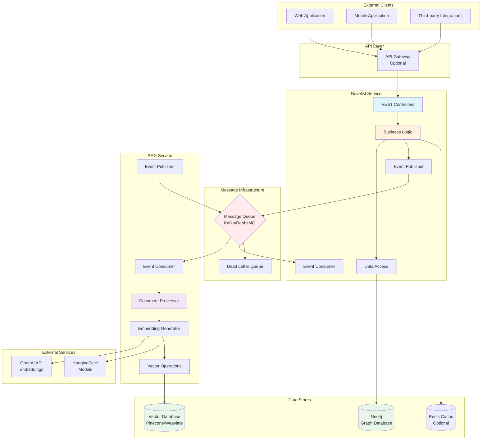
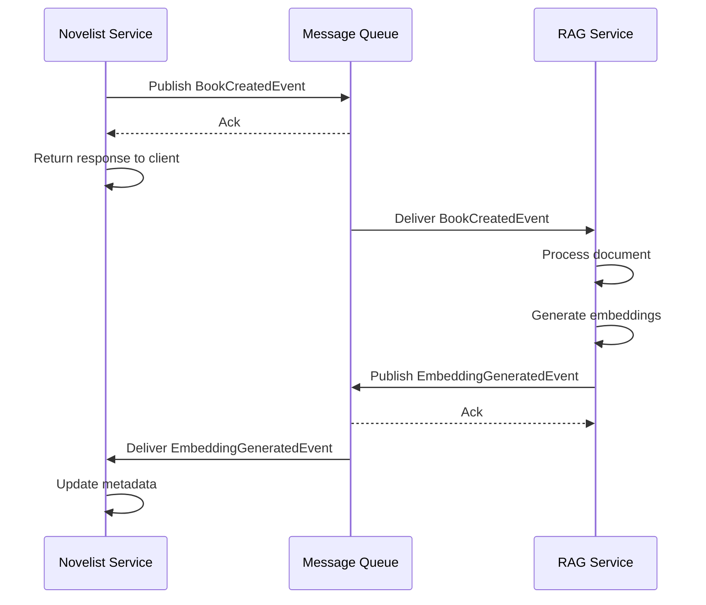
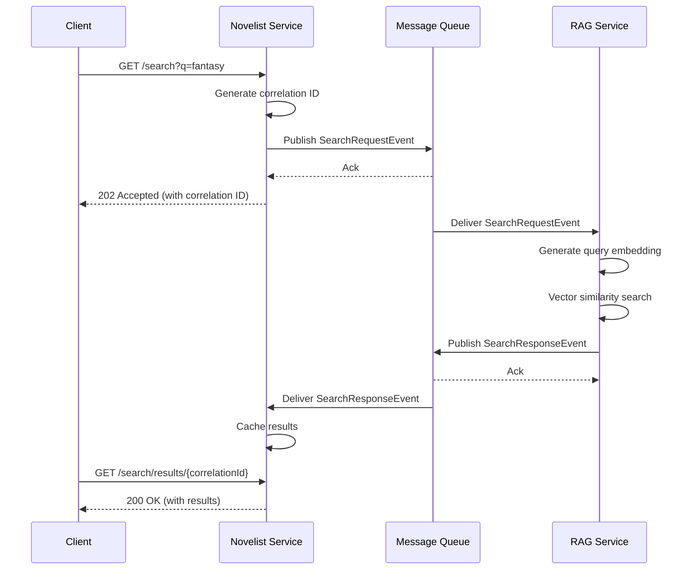
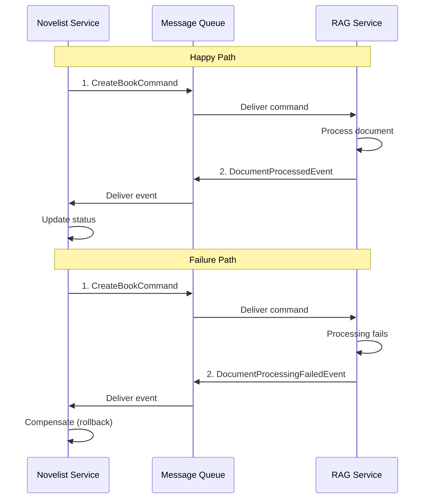
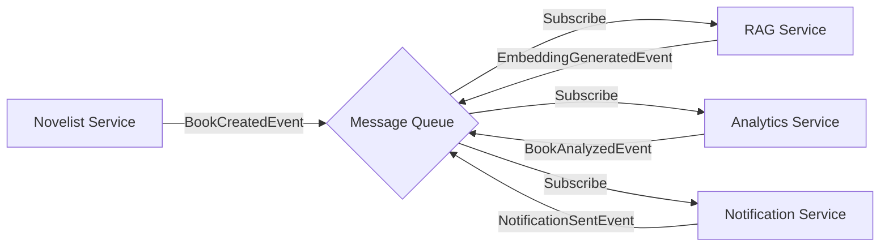

# Microservices Integration Specification

## Table of Contents
- [Overview](#overview)
- [Service Architecture](#service-architecture)
- [Novelist Service](#novelist-service)
- [RAG Ingestion Service](#rag-ingestion-service)
- [Message Queue Architecture](#message-queue-architecture)
- [Communication Patterns](#communication-patterns)
- [Service Discovery](#service-discovery)
- [Error Handling and Resilience](#error-handling-and-resilience)
- [Circuit Breaker Patterns](#circuit-breaker-patterns)
- [Health Checks](#health-checks)
- [Service Contracts](#service-contracts)

## Overview

The Novelist application follows a microservices architecture with event-driven communication patterns. Services communicate asynchronously through message queues, enabling loose coupling, scalability, and fault tolerance.

### Key Principles

1. **Loose Coupling**: Services are independent and communicate through well-defined interfaces
2. **High Cohesion**: Each service has a single, well-defined responsibility
3. **Autonomous**: Services can be deployed, scaled, and updated independently
4. **Resilient**: Services handle failures gracefully with retry and fallback mechanisms
5. **Observable**: All services expose metrics, logs, and traces

## Service Architecture



## Novelist Service

### Responsibilities

The Novelist service is the core application responsible for:

1. **Book Management**
   - CRUD operations for books
   - Book metadata management
   - Book search and filtering

2. **User Management**
   - User registration and profile management
   - User preferences and settings

3. **Rating System**
   - User ratings for books
   - Rating aggregation and statistics
   - Rating history

4. **Event Publishing**
   - Publish events for book operations
   - Publish search requests
   - Publish recommendation requests

5. **Event Consumption**
   - Consume embedding generation results
   - Consume search responses
   - Consume recommendation results

6. **API Gateway**
   - RESTful API endpoints
   - Request validation
   - Response formatting
   - Error handling

### Technology Stack

```yaml
Framework: Spring Boot 3.4.1
Language: Java 17
Database: Neo4j 5.15.0
Message Queue: Spring Kafka / Spring AMQP
Caching: Spring Cache (Redis optional)
API Docs: SpringDoc OpenAPI 3
Testing: JUnit 5, Mockito, Testcontainers
```

### Service Configuration

```yaml
# application.yml
spring:
  application:
    name: novelist-service
  
  neo4j:
    uri: ${NEO4J_URI:bolt://localhost:7687}
    authentication:
      username: ${NEO4J_USERNAME:neo4j}
      password: ${NEO4J_PASSWORD:password}
  
  kafka:  # or rabbitmq
    bootstrap-servers: ${KAFKA_BOOTSTRAP_SERVERS:localhost:9092}
    consumer:
      group-id: novelist-consumer-group
      auto-offset-reset: earliest
    producer:
      key-serializer: org.apache.kafka.common.serialization.StringSerializer
      value-serializer: org.springframework.kafka.support.serializer.JsonSerializer

server:
  port: 8081

management:
  endpoints:
    web:
      exposure:
        include: health,info,metrics,prometheus
  metrics:
    export:
      prometheus:
        enabled: true
```

### Service Endpoints

#### Internal Endpoints (for service communication)

```java
// Health check
GET /actuator/health

// Metrics
GET /actuator/metrics
GET /actuator/prometheus

// Service info
GET /actuator/info
```

#### Public API Endpoints

See [API_SPECIFICATION.md](./API_SPECIFICATION.md) for detailed API documentation.

### Event Publishing

```java
@Service
public class BookEventPublisher {
    
    @Autowired
    private KafkaTemplate<String, BookEvent> kafkaTemplate;
    
    private static final String BOOK_EVENTS_TOPIC = "book-events";
    
    public void publishBookCreated(Book book) {
        BookCreatedEvent event = BookCreatedEvent.builder()
            .eventId(UUID.randomUUID().toString())
            .timestamp(Instant.now())
            .bookId(book.getBookId())
            .title(book.getTitle())
            .author(book.getAuthor())
            .content(book.getContent())  // Full text for embedding
            .build();
        
        kafkaTemplate.send(BOOK_EVENTS_TOPIC, book.getBookId(), event);
        log.info("Published BookCreatedEvent for book: {}", book.getBookId());
    }
    
    public void publishBookUpdated(Book book) {
        BookUpdatedEvent event = BookUpdatedEvent.builder()
            .eventId(UUID.randomUUID().toString())
            .timestamp(Instant.now())
            .bookId(book.getBookId())
            .title(book.getTitle())
            .author(book.getAuthor())
            .content(book.getContent())
            .build();
        
        kafkaTemplate.send(BOOK_EVENTS_TOPIC, book.getBookId(), event);
        log.info("Published BookUpdatedEvent for book: {}", book.getBookId());
    }
    
    public void publishBookDeleted(String bookId) {
        BookDeletedEvent event = BookDeletedEvent.builder()
            .eventId(UUID.randomUUID().toString())
            .timestamp(Instant.now())
            .bookId(bookId)
            .build();
        
        kafkaTemplate.send(BOOK_EVENTS_TOPIC, bookId, event);
        log.info("Published BookDeletedEvent for book: {}", bookId);
    }
}
```

### Event Consumption

```java
@Service
public class EmbeddingEventConsumer {
    
    @Autowired
    private BookService bookService;
    
    @KafkaListener(
        topics = "embedding-events",
        groupId = "novelist-consumer-group"
    )
    public void consumeEmbeddingGenerated(EmbeddingGeneratedEvent event) {
        log.info("Received EmbeddingGeneratedEvent for book: {}", event.getBookId());
        
        try {
            // Update book with embedding metadata
            bookService.updateEmbeddingMetadata(
                event.getBookId(),
                event.getEmbeddingId(),
                event.getVectorDimensions(),
                event.getModel()
            );
            
            log.info("Successfully processed embedding for book: {}", event.getBookId());
        } catch (Exception e) {
            log.error("Failed to process embedding event: {}", e.getMessage(), e);
            throw e;  // Will be sent to DLQ
        }
    }
    
    @KafkaListener(
        topics = "search-response-events",
        groupId = "novelist-consumer-group"
    )
    public void consumeSearchResponse(SearchResponseEvent event) {
        log.info("Received SearchResponseEvent for query: {}", event.getQueryId());
        
        // Cache search results for quick retrieval
        searchResultCache.put(event.getQueryId(), event.getResults());
    }
}
```

## RAG Ingestion Service

### Responsibilities

The RAG service handles all document processing and semantic search operations:

1. **Document Ingestion**
   - Consume book creation/update events
   - Extract and preprocess text content
   - Chunk documents for embedding

2. **Embedding Generation**
   - Generate embeddings using AI models
   - Support multiple embedding models
   - Batch processing for efficiency

3. **Vector Storage**
   - Store embeddings in vector database
   - Manage vector indexes
   - Handle vector updates and deletions

4. **Semantic Search**
   - Process search queries
   - Generate query embeddings
   - Perform vector similarity search
   - Rank and filter results

5. **Recommendations**
   - Generate personalized recommendations
   - Compute book similarities
   - Consider user preferences

### Technology Stack Options

#### Option 1: Python-based Service

```yaml
Framework: FastAPI
Language: Python 3.11+
Libraries:
  - LangChain (document processing)
  - OpenAI / HuggingFace (embeddings)
  - Pinecone / Weaviate (vector storage)
  - Pydantic (data validation)
Message Queue: kafka-python / pika (RabbitMQ)
Testing: pytest, pytest-asyncio
```

#### Option 2: Java-based Service

```yaml
Framework: Spring Boot 3.4.1
Language: Java 17
Libraries:
  - Deep Java Library (DJL)
  - Apache Tika (document processing)
  - Spring AI (embeddings)
Message Queue: Spring Kafka / Spring AMQP
Testing: JUnit 5, Testcontainers
```

#### Option 3: External Service Integration

```yaml
Service: OpenAI API / Pinecone / Weaviate Cloud
Integration: REST API calls
Wrapper: Thin Spring Boot service for event handling
```

### Service Architecture (Python Example)

```python
# main.py
from fastapi import FastAPI
from kafka import KafkaConsumer, KafkaProducer
import json
from typing import List
import asyncio

app = FastAPI(title="RAG Ingestion Service")

# Kafka configuration
consumer = KafkaConsumer(
    'book-events',
    bootstrap_servers=['localhost:9092'],
    value_deserializer=lambda m: json.loads(m.decode('utf-8')),
    group_id='rag-consumer-group'
)

producer = KafkaProducer(
    bootstrap_servers=['localhost:9092'],
    value_serializer=lambda v: json.dumps(v).encode('utf-8')
)

# Document processor
class DocumentProcessor:
    def __init__(self):
        self.embedding_model = OpenAIEmbeddings()
        self.vector_store = PineconeVectorStore()
    
    async def process_book_created(self, event: dict):
        """Process book creation event"""
        book_id = event['bookId']
        content = event['content']
        
        # Chunk document
        chunks = self.chunk_document(content)
        
        # Generate embeddings
        embeddings = await self.embedding_model.embed_documents(chunks)
        
        # Store in vector database
        await self.vector_store.add_embeddings(
            book_id=book_id,
            embeddings=embeddings,
            metadata={'title': event['title'], 'author': event['author']}
        )
        
        # Publish success event
        self.publish_embedding_generated(book_id, len(embeddings))
    
    def chunk_document(self, content: str, chunk_size: int = 1000) -> List[str]:
        """Split document into chunks"""
        # Implementation
        pass
    
    def publish_embedding_generated(self, book_id: str, num_embeddings: int):
        """Publish embedding generated event"""
        event = {
            'eventId': str(uuid.uuid4()),
            'timestamp': datetime.utcnow().isoformat(),
            'bookId': book_id,
            'embeddingId': str(uuid.uuid4()),
            'vectorDimensions': 1536,
            'model': 'text-embedding-ada-002',
            'numChunks': num_embeddings
        }
        producer.send('embedding-events', value=event)

# Event consumer loop
async def consume_events():
    processor = DocumentProcessor()
    
    for message in consumer:
        event = message.value
        event_type = event.get('eventType')
        
        if event_type == 'BookCreated':
            await processor.process_book_created(event)
        elif event_type == 'BookUpdated':
            await processor.process_book_updated(event)
        elif event_type == 'BookDeleted':
            await processor.process_book_deleted(event)

# Health check endpoint
@app.get("/health")
async def health_check():
    return {"status": "healthy", "service": "rag-ingestion"}

# Metrics endpoint
@app.get("/metrics")
async def metrics():
    return {
        "processed_documents": document_counter,
        "embeddings_generated": embedding_counter,
        "errors": error_counter
    }
```

### Service Configuration

```yaml
# config.yml
service:
  name: rag-ingestion-service
  port: 8082

kafka:
  bootstrap_servers: localhost:9092
  consumer:
    group_id: rag-consumer-group
    topics:
      - book-events
      - search-request-events
  producer:
    topics:
      - embedding-events
      - search-response-events

embedding:
  provider: openai  # or huggingface, cohere
  model: text-embedding-ada-002
  dimensions: 1536
  batch_size: 100

vector_store:
  provider: pinecone  # or weaviate, qdrant
  index_name: novelist-books
  dimension: 1536
  metric: cosine

processing:
  chunk_size: 1000
  chunk_overlap: 200
  max_chunks_per_document: 50

retry:
  max_attempts: 3
  backoff_multiplier: 2
  max_backoff_seconds: 60
```

## Message Queue Architecture

### Kafka Configuration (Recommended for Production)

```yaml
# Kafka Topics
topics:
  - name: book-events
    partitions: 3
    replication_factor: 2
    retention_ms: 604800000  # 7 days
    
  - name: embedding-events
    partitions: 3
    replication_factor: 2
    retention_ms: 604800000
    
  - name: search-request-events
    partitions: 5
    replication_factor: 2
    retention_ms: 86400000  # 1 day
    
  - name: search-response-events
    partitions: 5
    replication_factor: 2
    retention_ms: 86400000
    
  - name: recommendation-events
    partitions: 3
    replication_factor: 2
    retention_ms: 86400000
```

### RabbitMQ Configuration (Alternative)

```yaml
# RabbitMQ Exchanges and Queues
exchanges:
  - name: novelist.events
    type: topic
    durable: true
    
queues:
  - name: book.events
    routing_key: book.*
    durable: true
    arguments:
      x-message-ttl: 604800000  # 7 days
      x-dead-letter-exchange: novelist.dlx
      
  - name: embedding.events
    routing_key: embedding.*
    durable: true
    
  - name: search.requests
    routing_key: search.request
    durable: true
    arguments:
      x-message-ttl: 86400000  # 1 day
      
  - name: search.responses
    routing_key: search.response
    durable: true
```

## Communication Patterns

### 1. Event-Driven Pattern (Async)

**Use Case**: Book creation, updates, deletions



**Benefits**:
- Non-blocking operations
- Loose coupling
- Fault tolerance
- Scalability

### 2. Request-Response Pattern (Async)

**Use Case**: Semantic search, recommendations



**Benefits**:
- Async processing
- Client can poll for results
- Supports long-running operations

### 3. Saga Pattern (Distributed Transactions)

**Use Case**: Complex operations spanning multiple services



### 4. Choreography Pattern

**Use Case**: Multiple services react to events independently



## Service Discovery

### Option 1: Static Configuration

```yaml
# application.yml
services:
  rag-service:
    url: http://rag-service:8082
    health-check: /health
    
  novelist-service:
    url: http://novelist-service:8081
    health-check: /actuator/health
```

### Option 2: Spring Cloud Netflix Eureka

```xml
<!-- pom.xml -->
<dependency>
    <groupId>org.springframework.cloud</groupId>
    <artifactId>spring-cloud-starter-netflix-eureka-client</artifactId>
</dependency>
```

```yaml
# application.yml
eureka:
  client:
    service-url:
      defaultZone: http://localhost:8761/eureka/
  instance:
    prefer-ip-address: true
```

### Option 3: Kubernetes Service Discovery

```yaml
# kubernetes-service.yml
apiVersion: v1
kind: Service
metadata:
  name: novelist-service
spec:
  selector:
    app: novelist
  ports:
    - protocol: TCP
      port: 8081
      targetPort: 8081
  type: ClusterIP
```

## Error Handling and Resilience

### Retry Strategy

```java
@Configuration
public class RetryConfig {
    
    @Bean
    public RetryTemplate retryTemplate() {
        RetryTemplate retryTemplate = new RetryTemplate();
        
        // Exponential backoff policy
        ExponentialBackOffPolicy backOffPolicy = new ExponentialBackOffPolicy();
        backOffPolicy.setInitialInterval(1000);  // 1 second
        backOffPolicy.setMultiplier(2.0);
        backOffPolicy.setMaxInterval(10000);  // 10 seconds
        
        // Simple retry policy
        SimpleRetryPolicy retryPolicy = new SimpleRetryPolicy();
        retryPolicy.setMaxAttempts(3);
        
        retryTemplate.setBackOffPolicy(backOffPolicy);
        retryTemplate.setRetryPolicy(retryPolicy);
        
        return retryTemplate;
    }
}

@Service
public class ResilientBookService {
    
    @Autowired
    private RetryTemplate retryTemplate;
    
    @Autowired
    private BookEventPublisher eventPublisher;
    
    public void publishBookCreatedWithRetry(Book book) {
        retryTemplate.execute(context -> {
            eventPublisher.publishBookCreated(book);
            return null;
        });
    }
}
```

### Dead Letter Queue (DLQ)

```java
@Configuration
public class KafkaErrorHandlingConfig {
    
    @Bean
    public ConcurrentKafkaListenerContainerFactory<String, BookEvent> 
            kafkaListenerContainerFactory() {
        
        ConcurrentKafkaListenerContainerFactory<String, BookEvent> factory =
            new ConcurrentKafkaListenerContainerFactory<>();
        
        // Configure error handler
        factory.setCommonErrorHandler(
            new DefaultErrorHandler(
                new DeadLetterPublishingRecoverer(kafkaTemplate()),
                new FixedBackOff(1000L, 3L)  // 3 retries with 1s delay
            )
        );
        
        return factory;
    }
    
    @Bean
    public KafkaTemplate<String, Object> kafkaTemplate() {
        return new KafkaTemplate<>(producerFactory());
    }
}
```

### Fallback Mechanisms

```java
@Service
public class SearchService {
    
    @Autowired
    private RAGSearchClient ragSearchClient;
    
    @Autowired
    private BookRepository bookRepository;
    
    @CircuitBreaker(name = "ragSearch", fallbackMethod = "fallbackSearch")
    public List<Book> semanticSearch(String query) {
        // Try RAG-powered semantic search
        return ragSearchClient.search(query);
    }
    
    public List<Book> fallbackSearch(String query, Exception e) {
        log.warn("RAG search failed, falling back to basic search: {}", e.getMessage());
        
        // Fallback to basic Neo4j text search
        return bookRepository.findByTitleContainingOrAuthorContaining(query, query);
    }
}
```

## Circuit Breaker Patterns

### Resilience4j Configuration

```xml
<!-- pom.xml -->
<dependency>
    <groupId>io.github.resilience4j</groupId>
    <artifactId>resilience4j-spring-boot3</artifactId>
    <version>2.1.0</version>
</dependency>
```

```yaml
# application.yml
resilience4j:
  circuitbreaker:
    instances:
      ragSearch:
        register-health-indicator: true
        sliding-window-size: 10
        minimum-number-of-calls: 5
        permitted-number-of-calls-in-half-open-state: 3
        automatic-transition-from-open-to-half-open-enabled: true
        wait-duration-in-open-state: 10s
        failure-rate-threshold: 50
        slow-call-rate-threshold: 50
        slow-call-duration-threshold: 2s
        
  retry:
    instances:
      ragSearch:
        max-attempts: 3
        wait-duration: 1s
        exponential-backoff-multiplier: 2
        
  timelimiter:
    instances:
      ragSearch:
        timeout-duration: 5s
```

### Circuit Breaker Usage

```java
@Service
public class RAGSearchClient {
    
    @CircuitBreaker(name = "ragSearch")
    @Retry(name = "ragSearch")
    @TimeLimiter(name = "ragSearch")
    public CompletableFuture<List<SearchResult>> searchAsync(String query) {
        return CompletableFuture.supplyAsync(() -> {
            // Call RAG service
            return ragService.search(query);
        });
    }
}
```

## Health Checks

### Novelist Service Health Check

```java
@Component
public class NovelistHealthIndicator implements HealthIndicator {
    
    @Autowired
    private Driver neo4jDriver;
    
    @Autowired
    private KafkaTemplate<String, Object> kafkaTemplate;
    
    @Override
    public Health health() {
        Health.Builder builder = new Health.Builder();
        
        // Check Neo4j connection
        try {
            neo4jDriver.verifyConnectivity();
            builder.up().withDetail("neo4j", "Connected");
        } catch (Exception e) {
            builder.down().withDetail("neo4j", "Disconnected: " + e.getMessage());
        }
        
        // Check Kafka connection
        try {
            kafkaTemplate.send("health-check", "ping").get(5, TimeUnit.SECONDS);
            builder.up().withDetail("kafka", "Connected");
        } catch (Exception e) {
            builder.down().withDetail("kafka", "Disconnected: " + e.getMessage());
        }
        
        return builder.build();
    }
}
```

### RAG Service Health Check

```python
@app.get("/health")
async def health_check():
    health_status = {
        "status": "healthy",
        "checks": {}
    }
    
    # Check vector database connection
    try:
        vector_store.ping()
        health_status["checks"]["vector_db"] = "connected"
    except Exception as e:
        health_status["status"] = "unhealthy"
        health_status["checks"]["vector_db"] = f"disconnected: {str(e)}"
    
    # Check embedding model
    try:
        embedding_model.health_check()
        health_status["checks"]["embedding_model"] = "available"
    except Exception as e:
        health_status["status"] = "unhealthy"
        health_status["checks"]["embedding_model"] = f"unavailable: {str(e)}"
    
    # Check Kafka connection
    try:
        producer.bootstrap_connected()
        health_status["checks"]["kafka"] = "connected"
    except Exception as e:
        health_status["status"] = "unhealthy"
        health_status["checks"]["kafka"] = f"disconnected: {str(e)}"
    
    status_code = 200 if health_status["status"] == "healthy" else 503
    return JSONResponse(content=health_status, status_code=status_code)
```

## Service Contracts

### Event Schemas

See [MESSAGE_QUEUE_DESIGN.md](./MESSAGE_QUEUE_DESIGN.md) for detailed event schemas.

### API Contracts

See [API_SPECIFICATION.md](./API_SPECIFICATION.md) for detailed API contracts.

### Contract Testing

```java
@SpringBootTest
@AutoConfigureWireMock
public class RAGServiceContractTest {
    
    @Test
    public void shouldConsumeBookCreatedEvent() {
        // Given
        BookCreatedEvent event = BookCreatedEvent.builder()
            .bookId("123")
            .title("Test Book")
            .author("Test Author")
            .content("Test content")
            .build();
        
        // When
        kafkaTemplate.send("book-events", event);
        
        // Then
        await().atMost(5, TimeUnit.SECONDS)
            .untilAsserted(() -> {
                verify(ragService).processBookCreated(event);
            });
    }
}
```

## Best Practices

### 1. Idempotency

Ensure all event handlers are idempotent:

```java
@Service
public class IdempotentEventHandler {
    
    @Autowired
    private ProcessedEventRepository processedEventRepo;
    
    @KafkaListener(topics = "book-events")
    public void handleBookEvent(BookEvent event) {
        // Check if already processed
        if (processedEventRepo.existsByEventId(event.getEventId())) {
            log.info("Event already processed: {}", event.getEventId());
            return;
        }
        
        // Process event
        processEvent(event);
        
        // Mark as processed
        processedEventRepo.save(new ProcessedEvent(event.getEventId()));
    }
}
```

### 2. Event Versioning

```java
public abstract class BaseEvent {
    private String eventId;
    private String eventType;
    private Integer version;  // Schema version
    private Instant timestamp;
}

@Service
public class VersionedEventHandler {
    
    public void handleEvent(BaseEvent event) {
        switch (event.getVersion()) {
            case 1:
                handleV1Event(event);
                break;
            case 2:
                handleV2Event(event);
                break;
            default:
                throw new UnsupportedEventVersionException(event.getVersion());
        }
    }
}
```

### 3. Correlation IDs

```java
@Component
public class CorrelationIdInterceptor implements HandlerInterceptor {
    
    private static final String CORRELATION_ID_HEADER = "X-Correlation-ID";
    
    @Override
    public boolean preHandle(HttpServletRequest request, 
                            HttpServletResponse response, 
                            Object handler) {
        String correlationId = request.getHeader(CORRELATION_ID_HEADER);
        if (correlationId == null) {
            correlationId = UUID.randomUUID().toString();
        }
        MDC.put("correlationId", correlationId);
        response.setHeader(CORRELATION_ID_HEADER, correlationId);
        return true;
    }
}
```

### 4. Monitoring and Alerting

```java
@Service
public class MonitoredEventPublisher {
    
    @Autowired
    private MeterRegistry meterRegistry;
    
    public void publishEvent(BookEvent event) {
        Timer.Sample sample = Timer.start(meterRegistry);
        
        try {
            kafkaTemplate.send("book-events", event);
            
            meterRegistry.counter("events.published", 
                "type", event.getEventType(),
                "status", "success"
            ).increment();
            
        } catch (Exception e) {
            meterRegistry.counter("events.published",
                "type", event.getEventType(),
                "status", "failure"
            ).increment();
            throw e;
        } finally {
            sample.stop(meterRegistry.timer("events.publish.duration",
                "type", event.getEventType()));
        }
    }
}
```

## Next Steps

1. Implement event publishers in Novelist service
2. Set up message queue infrastructure (Kafka/RabbitMQ)
3. Develop RAG service with event consumers
4. Implement circuit breakers and retry logic
5. Set up health checks and monitoring
6. Implement contract tests
7. Deploy services to staging environment
8. Performance testing and optimization

## References

- [Microservices Patterns](https://microservices.io/patterns/index.html)
- [Spring Cloud Documentation](https://spring.io/projects/spring-cloud)
- [Apache Kafka Documentation](https://kafka.apache.org/documentation/)
- [RabbitMQ Documentation](https://www.rabbitmq.com/documentation.html)
- [Resilience4j Documentation](https://resilience4j.readme.io/)
- [Event-Driven Architecture](https://martinfowler.com/articles/201701-event-driven.html)

---

**Document Version**: 1.0  
**Last Updated**: 2026-06-18  
**Author**: Bob (AI Assistant)  
**Status**: Draft