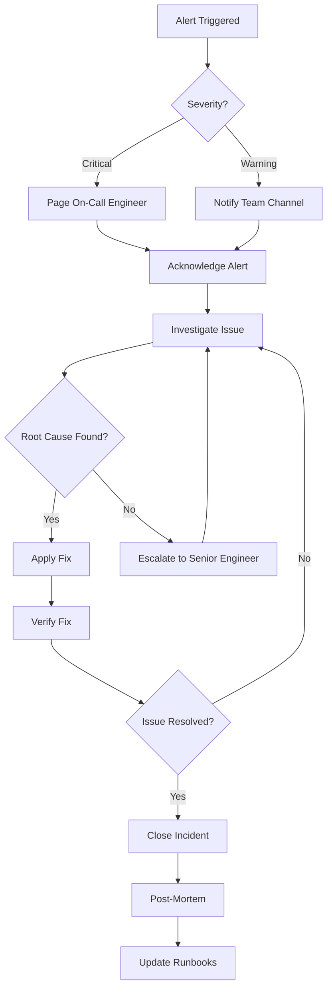

 "Active Users",
        "type": "stat",
        "targets": [
          {
            "expr": "novelist_users_active",
            "legendFormat": "Active Users"
          }
        ],
        "gridPos": {"x": 12, "y": 16, "w": 6, "h": 4}
      },
      {
        "id": 7,
        "title": "Total Books",
        "type": "stat",
        "targets": [
          {
            "expr": "novelist_books_total",
            "legendFormat": "Total Books"
          }
        ],
        "gridPos": {"x": 18, "y": 16, "w": 6, "h": 4}
      }
    ]
  }
}
```

### Business Metrics Dashboard

```json
{
  "dashboard": {
    "title": "Novelist Business Metrics",
    "panels": [
      {
        "title": "Books Created (24h)",
        "type": "stat",
        "targets": [
          {
            "expr": "increase(novelist_books_created_total[24h])"
          }
        ]
      },
      {
        "title": "Reviews Created (24h)",
        "type": "stat",
        "targets": [
          {
            "expr": "increase(novelist_reviews_created_total[24h])"
          }
        ]
      },
      {
        "title": "Search Requests",
        "type": "graph",
        "targets": [
          {
            "expr": "rate(novelist_search_requests_total[5m])",
            "legendFormat": "{{content_type}}"
          }
        ]
      },
      {
        "title": "Average Review Rating",
        "type": "gauge",
        "targets": [
          {
            "expr": "avg(novelist_reviews_by_rating)"
          }
        ]
      }
    ]
  }
}
```

### RAG Service Dashboard

```json
{
  "dashboard": {
    "title": "RAG Service Metrics",
    "panels": [
      {
        "title": "Embedding Generation Rate",
        "type": "graph",
        "targets": [
          {
            "expr": "rate(rag_embedding_requests_total[5m])",
            "legendFormat": "{{content_type}}"
          }
        ]
      },
      {
        "title": "Embedding Generation Duration",
        "type": "graph",
        "targets": [
          {
            "expr": "histogram_quantile(0.95, rate(rag_embedding_duration_seconds_bucket[5m]))",
            "legendFormat": "p95"
          }
        ]
      },
      {
        "title": "Search Performance",
        "type": "graph",
        "targets": [
          {
            "expr": "histogram_quantile(0.95, rate(rag_search_duration_seconds_bucket[5m]))",
            "legendFormat": "p95"
          }
        ]
      },
      {
        "title": "Vector Database Size",
        "type": "graph",
        "targets": [
          {
            "expr": "rag_vector_db_size",
            "legendFormat": "{{collection}}"
          }
        ]
      },
      {
        "title": "Embedding Cost (Hourly)",
        "type": "stat",
        "targets": [
          {
            "expr": "rate(rag_embedding_tokens_total[1h]) * 0.0001 / 1000"
          }
        ]
      }
    ]
  }
}
```

## SLA/SLO Tracking

### Service Level Objectives

**Availability SLO**: 99.9% uptime
```promql
# Calculate availability over 30 days
(
  sum(up{job="novelist-service"} == 1) 
  / 
  count(up{job="novelist-service"})
) * 100
```

**Latency SLO**: 95% of requests < 500ms
```promql
# Calculate percentage of requests meeting latency SLO
(
  sum(rate(http_server_requests_seconds_bucket{le="0.5"}[30d]))
  /
  sum(rate(http_server_requests_seconds_count[30d]))
) * 100
```

**Error Rate SLO**: < 0.1% error rate
```promql
# Calculate error rate
(
  sum(rate(http_server_requests_seconds_count{status=~"5.."}[30d]))
  /
  sum(rate(http_server_requests_seconds_count[30d]))
) * 100
```

### SLO Dashboard

```java
@Component
public class SLOTracker {
    
    private final MeterRegistry registry;
    
    @Scheduled(fixedRate = 60000)
    public void trackSLOs() {
        // Track availability
        double availability = calculateAvailability();
        Gauge.builder("slo.availability", () -> availability)
            .description("Service availability percentage")
            .register(registry);
        
        // Track latency SLO
        double latencySLO = calculateLatencySLO();
        Gauge.builder("slo.latency", () -> latencySLO)
            .description("Percentage of requests meeting latency SLO")
            .register(registry);
        
        // Track error rate SLO
        double errorRateSLO = calculateErrorRateSLO();
        Gauge.builder("slo.error_rate", () -> errorRateSLO)
            .description("Error rate percentage")
            .register(registry);
        
        // Calculate error budget
        double errorBudget = calculateErrorBudget();
        Gauge.builder("slo.error_budget", () -> errorBudget)
            .description("Remaining error budget")
            .register(registry);
    }
    
    private double calculateErrorBudget() {
        // Error budget = (1 - SLO) * total requests
        double slo = 0.999;  // 99.9%
        double totalRequests = getTotalRequests();
        double allowedErrors = (1 - slo) * totalRequests;
        double actualErrors = getActualErrors();
        
        return allowedErrors - actualErrors;
    }
}
```

### Error Budget Alerts

```yaml
- alert: ErrorBudgetExhausted
  expr: slo_error_budget < 0
  for: 5m
  labels:
    severity: critical
  annotations:
    summary: "Error budget exhausted"
    description: "Error budget is {{ $value }}, deployment freeze recommended"

- alert: ErrorBudgetLow
  expr: slo_error_budget < 100
  for: 10m
  labels:
    severity: warning
  annotations:
    summary: "Error budget running low"
    description: "Only {{ $value }} errors remaining in budget"
```

## Incident Response

### Incident Response Workflow



### Incident Response Runbooks

**Runbook: High Error Rate**

```markdown
# High Error Rate Runbook

## Symptoms
- Error rate > 5% for 5 minutes
- Alert: HighErrorRate

## Investigation Steps

1. Check error logs in Kibana:
   ```
   level:ERROR AND application:novelist-service
   ```

2. Check recent deployments:
   ```bash
   kubectl rollout history deployment/novelist-app -n novelist
   ```

3. Check dependent services:
   - Neo4j health: `curl http://neo4j:7474`
   - Kafka health: Check consumer lag
   - RAG service health: `curl http://rag-service:8080/health`

4. Check metrics:
   - CPU usage
   - Memory usage
   - Database connection pool

## Common Causes

1. **Database Connection Issues**
   - Check Neo4j logs
   - Verify connection pool settings
   - Restart Neo4j if necessary

2. **RAG Service Unavailable**
   - Check RAG service logs
   - Verify network connectivity
   - Restart RAG service if necessary

3. **Memory Leak**
   - Check heap usage
   - Generate heap dump
   - Restart application

## Resolution Steps

1. **Rollback Deployment** (if recent deployment):
   ```bash
   kubectl rollout undo deployment/novelist-app -n novelist
   ```

2. **Restart Service**:
   ```bash
   kubectl rollout restart deployment/novelist-app -n novelist
   ```

3. **Scale Up**:
   ```bash
   kubectl scale deployment novelist-app --replicas=5 -n novelist
   ```

## Post-Incident

1. Document root cause
2. Update monitoring/alerting
3. Schedule post-mortem
4. Update runbook
```

**Runbook: High Latency**

```markdown
# High Latency Runbook

## Symptoms
- 95th percentile latency > 1s for 5 minutes
- Alert: HighLatency

## Investigation Steps

1. Identify slow endpoints:
   ```promql
   topk(10, histogram_quantile(0.95, 
     rate(http_server_requests_seconds_bucket[5m])
   ))
   ```

2. Check database query performance:
   ```cypher
   CALL dbms.listQueries() YIELD query, elapsedTimeMillis
   WHERE elapsedTimeMillis > 1000
   RETURN query, elapsedTimeMillis
   ORDER BY elapsedTimeMillis DESC
   ```

3. Check RAG service latency:
   ```promql
   histogram_quantile(0.95, 
     rate(rag_search_duration_seconds_bucket[5m])
   )
   ```

4. Check resource utilization:
   - CPU usage
   - Memory usage
   - Network I/O

## Common Causes

1. **Slow Database Queries**
   - Missing indexes
   - Complex queries
   - Large result sets

2. **RAG Service Slow**
   - High embedding generation load
   - Vector database performance
   - Network latency

3. **Resource Contention**
   - High CPU usage
   - Memory pressure
   - Disk I/O bottleneck

## Resolution Steps

1. **Optimize Queries**:
   - Add indexes
   - Optimize Cypher queries
   - Implement caching

2. **Scale Services**:
   ```bash
   kubectl scale deployment novelist-app --replicas=5 -n novelist
   kubectl scale deployment rag-service --replicas=3 -n novelist
   ```

3. **Enable Caching**:
   - Redis for API responses
   - Embedding cache for RAG service

4. **Increase Resources**:
   ```bash
   kubectl set resources deployment novelist-app \
     --limits=cpu=4,memory=8Gi \
     --requests=cpu=2,memory=4Gi \
     -n novelist
   ```
```

### Incident Communication Template

```markdown
# Incident Report Template

## Incident Summary
- **Incident ID**: INC-2026-001
- **Severity**: Critical/High/Medium/Low
- **Status**: Investigating/Identified/Monitoring/Resolved
- **Start Time**: 2026-06-18 10:00 UTC
- **End Time**: 2026-06-18 10:30 UTC
- **Duration**: 30 minutes

## Impact
- **Affected Services**: Novelist API, Search functionality
- **User Impact**: 500 users unable to search books
- **Business Impact**: 10% reduction in search requests

## Timeline
- 10:00 - Alert triggered: High error rate
- 10:05 - On-call engineer acknowledged
- 10:10 - Root cause identified: RAG service down
- 10:15 - RAG service restarted
- 10:20 - Service recovered
- 10:30 - Incident resolved

## Root Cause
RAG service crashed due to out-of-memory error caused by memory leak in embedding cache.

## Resolution
1. Restarted RAG service
2. Increased memory limits
3. Fixed memory leak in code

## Action Items
- [ ] Deploy memory leak fix
- [ ] Add memory usage alerts
- [ ] Implement circuit breaker for RAG service
- [ ] Schedule post-mortem meeting

## Lessons Learned
- Need better memory monitoring for RAG service
- Circuit breaker would have prevented cascading failure
- Faster incident detection needed
```

### Post-Mortem Template

```markdown
# Post-Mortem: High Error Rate Incident

## Date
2026-06-18

## Authors
- John Doe (On-call Engineer)
- Jane Smith (Engineering Manager)

## Status
Complete

## Summary
RAG service experienced an out-of-memory error causing a 30-minute outage affecting search functionality.

## Impact
- **Duration**: 30 minutes
- **Users Affected**: ~500 users
- **Revenue Impact**: Estimated $1,000
- **Reputation Impact**: 15 support tickets

## Root Cause
Memory leak in embedding cache implementation caused gradual memory growth until OOM error.

## Trigger
High volume of search requests during peak hours exceeded memory capacity.

## Detection
Prometheus alert triggered after 5 minutes of high error rate.

## Resolution
1. Restarted RAG service (immediate fix)
2. Increased memory limits (temporary fix)
3. Fixed memory leak in code (permanent fix)

## Timeline (All times UTC)
- 09:55 - Memory usage begins climbing
- 10:00 - RAG service OOM, crashes
- 10:00 - Alert triggered
- 10:05 - On-call engineer acknowledged
- 10:10 - Root cause identified
- 10:15 - Service restarted
- 10:20 - Service recovered
- 10:30 - Monitoring confirmed stable

## What Went Well
- Alert triggered quickly
- On-call engineer responded promptly
- Root cause identified efficiently
- Communication was clear

## What Went Wrong
- Memory leak not caught in testing
- No memory usage alerts for RAG service
- No circuit breaker to prevent cascading failure
- Manual restart required

## Action Items

### Immediate (This Week)
- [x] Deploy memory leak fix
- [x] Add memory usage alerts
- [ ] Implement circuit breaker

### Short-term (This Month)
- [ ] Add memory profiling to CI/CD
- [ ] Implement automatic service restart on OOM
- [ ] Add load testing for peak scenarios

### Long-term (This Quarter)
- [ ] Implement comprehensive chaos engineering
- [ ] Add predictive alerting
- [ ] Improve observability for RAG service

## Lessons Learned
1. Memory leaks can be subtle and hard to detect
2. Monitoring all services is critical
3. Circuit breakers prevent cascading failures
4. Load testing should include peak scenarios
5. Automatic recovery mechanisms are valuable
```

## Best Practices

### 1. Correlation IDs

Always use correlation IDs to track requests across services:

```java
@Component
public class CorrelationIdFilter extends OncePerRequestFilter {
    
    private static final String CORRELATION_ID_HEADER = "X-Correlation-ID";
    
    @Override
    protected void doFilterInternal(
        HttpServletRequest request,
        HttpServletResponse response,
        FilterChain filterChain
    ) throws ServletException, IOException {
        
        String correlationId = request.getHeader(CORRELATION_ID_HEADER);
        
        if (correlationId == null) {
            correlationId = UUID.randomUUID().toString();
        }
        
        MDC.put("correlationId", correlationId);
        response.setHeader(CORRELATION_ID_HEADER, correlationId);
        
        try {
            filterChain.doFilter(request, response);
        } finally {
            MDC.remove("correlationId");
        }
    }
}
```

### 2. Structured Logging

Always use structured logging with consistent fields:

```java
log.info("User action completed",
    kv("userId", userId),
    kv("action", "createBook"),
    kv("bookId", bookId),
    kv("duration", duration),
    kv("status", "success")
);
```

### 3. Metric Naming Conventions

Follow consistent naming conventions:

```
<namespace>.<subsystem>.<metric_name>.<unit>

Examples:
- novelist.books.created.total
- novelist.search.duration.seconds
- novelist.reviews.length.characters
```

### 4. Alert Fatigue Prevention

- Set appropriate thresholds
- Use alert grouping
- Implement alert suppression during maintenance
- Regular alert review and tuning

### 5. Dashboard Organization

- Overview dashboard for high-level metrics
- Service-specific dashboards
- Business metrics dashboard
- SLA/SLO tracking dashboard
- Incident response dashboard

### 6. Data Retention

```yaml
# Prometheus retention
storage:
  tsdb:
    retention.time: 30d
    retention.size: 50GB

# Elasticsearch retention
curator:
  actions:
    delete_indices:
      action: delete_indices
      filters:
        - filtertype: age
          source: creation_date
          direction: older
          unit: days
          unit_count: 30

# Jaeger retention
storage:
  type: elasticsearch
  options:
    es:
      index-prefix: jaeger
      max-span-age: 168h  # 7 days
```

## Monitoring Checklist

### Application Monitoring
- [ ] Request rate and latency metrics
- [ ] Error rate and types
- [ ] Business metrics (books, reviews, searches)
- [ ] Custom application metrics
- [ ] JVM metrics (heap, GC, threads)

### Infrastructure Monitoring
- [ ] CPU usage
- [ ] Memory usage
- [ ] Disk usage and I/O
- [ ] Network traffic
- [ ] Container/Pod health

### Database Monitoring
- [ ] Query performance
- [ ] Connection pool usage
- [ ] Transaction rates
- [ ] Replication lag (if applicable)
- [ ] Storage usage

### Message Queue Monitoring
- [ ] Consumer lag
- [ ] Message throughput
- [ ] Error rates
- [ ] Queue depth
- [ ] Broker health

### External Service Monitoring
- [ ] RAG service health
- [ ] OpenAI API usage and costs
- [ ] Vector database performance
- [ ] Third-party API availability

### Security Monitoring
- [ ] Failed authentication attempts
- [ ] Unusual access patterns
- [ ] API rate limit violations
- [ ] Security scan results

### Business Monitoring
- [ ] User signups
- [ ] Active users
- [ ] Content creation rates
- [ ] Search usage
- [ ] Recommendation effectiveness

## References

- [Prometheus Documentation](https://prometheus.io/docs/)
- [Grafana Documentation](https://grafana.com/docs/)
- [Jaeger Documentation](https://www.jaegertracing.io/docs/)
- [ELK Stack Documentation](https://www.elastic.co/guide/)
- [Spring Boot Actuator](https://docs.spring.io/spring-boot/docs/current/reference/html/actuator.html)
- [Micrometer Documentation](https://micrometer.io/docs)
- [Spring Cloud Sleuth](https://spring.io/projects/spring-cloud-sleuth)
- [Site Reliability Engineering Book](https://sre.google/books/)
- [The Art of Monitoring](https://artofmonitoring.com/)

---

**Document Version**: 1.0  
**Last Updated**: 2026-06-18  
**Author**: Bob (AI Assistant)  
**Status**: Production Ready